此处展示一些好的、不好的以及异常的训练模式。内容整理自 Stas Bekman 的 [Machine Learning Engineering by Stas Bekman](https://github.com/stas00/ml-engineering)。

# 一个非常失败的训练案例

在启动 BLOOM-176B 训练之前，我们用 104B 模型做了多次实验。但始终没能解决 **训练很早就出现梯度发散（diverge）** 的问题。如下图所示：

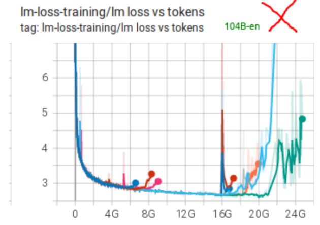


我们做了很多尝试，也用了很多技术（详见之前的记录）。我们认为主要障碍有两个：
- 使用了 **FP16**（半精度浮点数）
- 数据中包含大量**垃圾/噪声数据**

对于 [BLOOM-176B](https://github.com/bigscience-workshop/bigscience/tree/master/train/tr11-176B-ml) 的训练，我们改为使用 **BF16**，使用了**更干净的数据**，并额外添加了一个 **embedding layer-norm**。这些改进带来了巨大的不同。BLOOM-176B 的训练损失曲线几乎完美，只出现了一次明显的尖峰（spike），而且在 200 步内就恢复了。如下图所示：

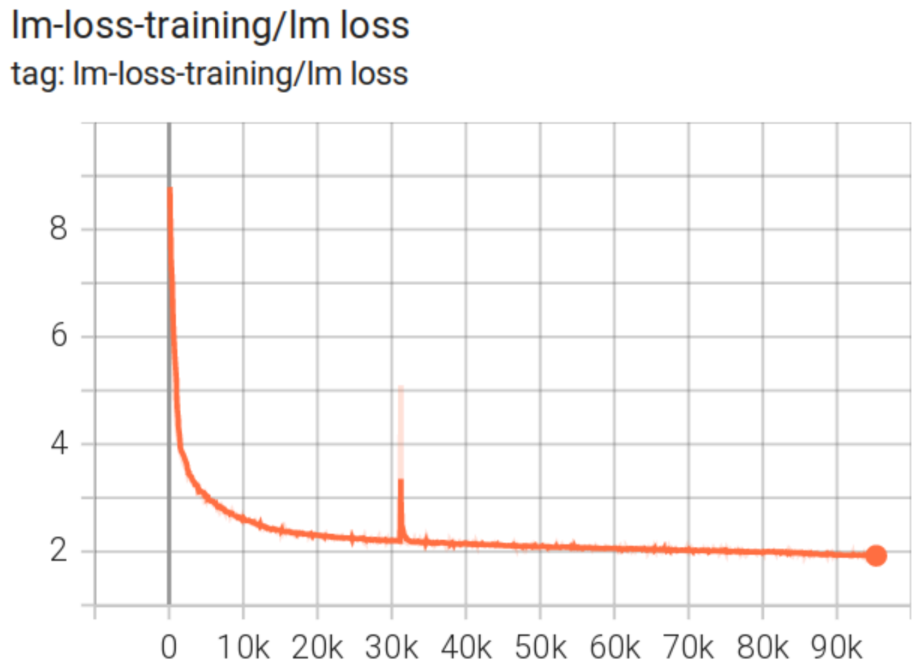

你可以查看 [TensorBoard](https://huggingface.co/bigscience/tr11-176B-logs/tensorboard) 放大细节并检查其他曲线。

## 该失败案列的整个训练日志

BigScience 团队原本想训练一个约 **104B 参数**的 Transformer 语言模型，但训练过程中反复出现类似问题：

- 训练刚开始一段时间 loss 正常下降；
- 到某个迭代步附近，尤其是学习率 warmup 接近结束或结束后，loss 突然飙升；
- 有时 loss 会短暂恢复；
- 但之后又继续恶化，最后变成 **NaN**；
- 多次回滚 checkpoint、改随机种子、改优化器参数、改模型结构、改学习率，都没能彻底解决。

所以这份文档记录了他们从 **Experiment 1 到 Experiment 10** 的尝试过程。原文档[bigscience/train/tr8-104B-wide/chronicles.md](https://github.com/bigscience-workshop/bigscience/raw/refs/heads/master/train/tr8-104B-wide/chronicles.md)。


### Experiment 1：第一次训练，loss 在 7000 步附近爆炸

配置：

```text
Nodes: 64
Seed: 42
Started from iteration 0
```

训练从头开始。到大约 iteration 7000 时，`lm loss` 从 6.4 突然跳到 14，后来又回到约 7，但训练质量已经受损，之后进入 NaN。`lm loss` 随 iteration 变化如下图：

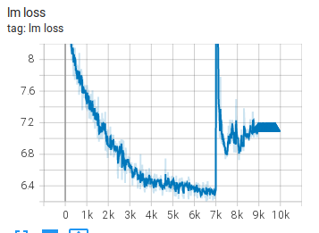

他们认为继续训练没有帮助，于是采取措施：

1. 回滚到最后一个正常 checkpoint：`global_step6210`；
2. 改随机种子，从 `42` 改为 `43`；
3. 清理 TensorBoard 日志中回滚之后的部分；
4. 保存原始出问题的 TensorBoard 数据，方便以后复盘。

他们还提到，改 seed 会重新生成数据顺序。如果问题是某一批坏数据导致的，那么重新 shuffle 数据有可能解决。

但后续证明，问题并没有消失。

---

### Experiment 2：换 seed 后问题更早出现

配置：

```text
Nodes: 64
Seed: 43
Restarted from global_step6210
```


这次从 6210 步 checkpoint 继续训练，随机种子变成 43。

结果类似：

- loss 从 6.3 上升到 9，再到 10；
- 梯度 norm 也出现异常增大；
- 问题比第一次更早出现。

这里有一个重要讨论：Conglong Li 观察到这几次 glitch 都接近 **学习率 warmup 结束**[^1]。

[^1]: `LR warmup` 是学习率预热。训练初期不直接用最大学习率，而是从较小值逐步升高到目标学习率

他认为：

- warmup 结束附近梯度最大；
- Adam 优化器的梯度方差在学习率峰值附近也最不稳定；
- 这是训练最容易发散的时候。

团队还回顾了之前的 13B 模型训练，也曾在 warmup 结束附近出现过巨大 loss spike，但较小的模型后来恢复了，如下图所示。而 104B 这个模型没有恢复。

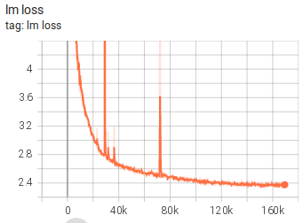

LR warmup 在大概第 25k 次迭代时世界树，而第一个大的 glitch 出现在大概第 29k 次迭代时。25k 和 29 k在数值上是足够接近的。

此外，团队对 [1.5B 参数的 GPT-2 模型进行的研究](https://arxiv.org/pdf/2108.06084.pdf)中，使用了 3k 步的学习率预热。在这里看到，梯度方差范数（左图）直到 8k 多步后才达到底部，而基线的梯度方差最大值在前 10k 多步期间一直很不稳定。

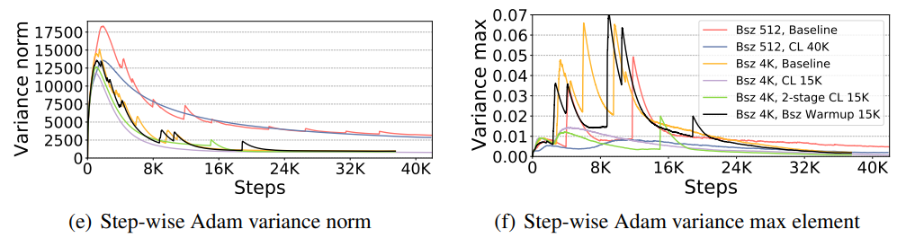


因此他们开始怀疑：

> 这可能不是单纯的数据问题，而是大模型训练稳定性问题。

---

### Experiment 3：尝试更稳定的 self-attention 计算

有人建议 attention 的计算方式可能导致 fp16 数值不稳定。

原先计算 attention score 时，可能是：

```text
QK^T 之后再乘缩放因子
```

如果 Q 和 K 的维度很大，矩阵乘法结果可能先变得非常大，再乘缩放因子已经来不及避免溢出。

建议改成：

```text
先缩放 Q 和 K，再做矩阵乘法
```

数学上两者等价：

```text
n * (A dot B) == (sqrt(n) * A) dot (sqrt(n) * B)
```

这样可以减少中间结果过大的风险。

他们回滚到 `iteration 6210`，保持 seed 43，也关闭了 codecarbon 的日志噪音。

但结果：

- Experiment 3 仍然以类似 Experiment 2 的方式失败。

说明 attention 中这个数值稳定性修改没有解决根本问题。

---

### Experiment 4：尝试 Adam beta2 = 0.95，并更早回滚

Iz Beltagy 提出了一组假设和建议。

他认为可能原因包括：

#### 可能原因 1：坏数据

如果是坏数据导致，重新 shuffle 数据应该有帮助。但团队之前改 seed 后问题仍然存在，所以他不太相信是数据问题。

#### 可能原因 2：fp16 问题

如果 fp16 不稳定，可以试试全 fp32。如果 fp32 正常，就说明问题在 fp16 数值稳定性上。

#### 可能原因 3：Adam beta2 太高

他们使用的是：

```text
beta2 = 0.999
```

而 GPT-3 使用过：

```text
beta2 = 0.95
```

较低的 beta2 可能更稳定，但训练会慢一些。

#### 可能原因 4：模型结构设计不好

这个模型被称为 “wide”，意思是宽度很大、层数相对较少。Iz 认为宽深比例可能不合理，导致模型学得不好，也更容易发散。

#### 可能原因 5：回滚点太晚

他观察 loss-scale 曲线，认为模型可能早在 4700 步左右就已经开始朝发散方向发展。因此建议回滚到更早，比如 3000 步。

所以 Experiment 4 的改动是：

```text
回滚到 iteration 3000
adam-beta2 = 0.95
```

结果如图：

> 训练在 iteration 5000 附近又朝错误方向发展，实验停止。

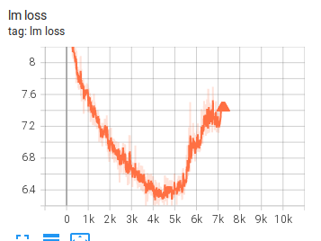


### Experiment 5：从头开始，仍然 beta2 = 0.95

Experiment 5 基本和 Experiment 4 一样，但不是从 3000 步恢复，而是从头开始。

结果如下图：

> 仍然在 5000 步附近发散。

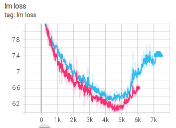

这说明仅仅改 Adam beta2 并不能解决问题。


### Experiment 6：发现模型配置有严重错误

这是文档中很重要的转折点。

他们发现之前所有实验都有一个严重配置错误：

```text
FFN_HIDDEN_SIZE 没有从 13B 配置更新到 104B 配置
```

原来它仍然是：

```text
FFN_HIDDEN_SIZE = 20480
```

但正确应该是：

```text
FFN_HIDDEN_SIZE = 65536
```

在 Transformer 中，FFN hidden size 通常是 hidden size 的 4 倍：

```text
FFN_HIDDEN_SIZE = 4 * HIDDEN_SIZE
```

由于这个值太小，之前训练的其实不是预期中的 104B 模型，而是一个结构非常不平衡的约 **58B 模型**。

他们总结教训：

> 以后不要在 slurm 脚本里手动设置 FFN_HIDDEN_SIZE，而是让 Megatron 自动设置为 4 * HIDDEN_SIZE，避免类似错误。

修正后，模型显存需求大幅增加，需要更多并行配置：

```text
TP_SIZE = 4
PP_SIZE = 32
```

解释：

- TP = Tensor Parallelism，张量并行；
- PP = Pipeline Parallelism，流水线并行；
- 模型越大，需要更多 GPU 切分。

但即使修复模型结构后，Experiment 6 的结果仍然类似：

> loss 仍然出现发散。

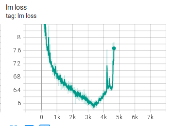

这说明 FFN 配置错误虽然严重，但不是唯一原因。

### Experiment 7：调整宽深比，做成更“正常”的模型

之前模型太“宽”，宽深比例大约是 512。团队认为这可能不合理。

于是尝试把模型改成更深、更窄：

```text
NLAYERS = 64
NHIDDEN = 11600
NHEADS = 80
```

也就是：

- 层数从 32 增加到 64；
- hidden size 从 16384 降到 11600；
- attention heads 改为 80；
- 宽深比例从 512 降到约 180。

他们认为这更接近 Megatron 论文中大模型的常见比例。

结果：

> Experiment 7 仍然失败。

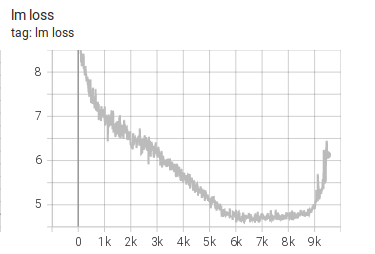

### Experiment 8：学习率减半，warmup 略加长

配置修改：

```text
lr = 3e-5
lr-warmup-samples = 300_000
```

也就是把学习率从之前的 `6e-5` 降到 `3e-5`，并把 warmup 稍微加长。

结果：

> 失败模式和 Experiment 7 类似。

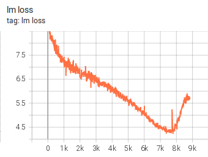

### Experiment 9：更长 warmup

配置：

```text
lr = 3e-5
lr-warmup-samples = 1_000_000
```

这次 warmup 更长，想让学习率上升得更慢，训练更稳定。

结果：

> 仍然类似失败。

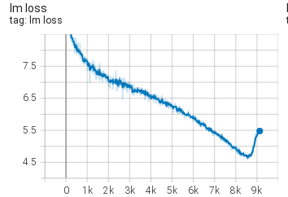

### Experiment 10：学习率降到 1e-5

配置：

```text
lr = 1e-5
```

最初他们想从 Experiment 9 的 6900 步继续训练，但 Megatron 不允许 checkpoint 中的学习率配置和当前配置不一致，于是只能从头开始。

结果：

> 仍然失败。

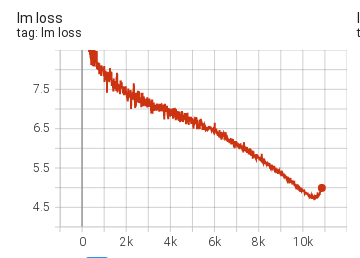


不过这些学习率实验有一个规律：

| 实验 | 学习率 | warmup |
|---:|---:|---:|
| 7 | 6e-5 | 0.26M |
| 8 | 3e-5 | 0.3M |
| 9 | 3e-5 | 1M |
| 10 | 1e-5 | 1M |

他们总结说：

> 四个实验行为很相似，只是学习停止和发散发生得越来越晚。

也就是说，降低学习率和拉长 warmup 能推迟问题，但没有消除问题。

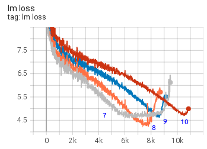

我来逐页翻译这些关于训练损失尖峰（loss spikes）的内容：

# 训练过程中的“顿悟”时刻

在训练过程中，可能突然出现在极小的迭代次数后，损失发生大幅度下降的现象：

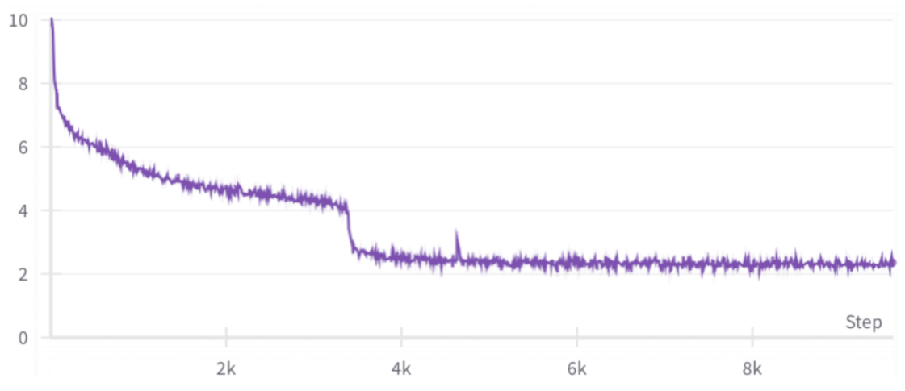

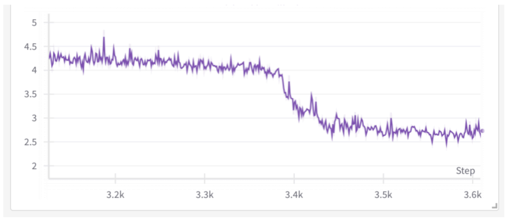

作者将其称为“顿悟”时刻（grokking moment），但是还没相关的文献研究解释这种现象。

# 损失尖峰的主要类型

一般来说，损失尖峰有 3 种类型：

1. **快速恢复的尖峰**
2. **缓慢恢复的尖峰**
3. **未能完全恢复的尖峰**

这些尖峰通常是由**坏数据块**引起的，原因可能是数据洗牌（shuffle）不充分，或者数据来自从网站上爬取的垃圾内容，未经清洗。

虽然人们可能会怀疑尖峰发生前的那一批数据是触发原因，但如果你去研究那批数据的内容，你很可能会发现并无异常——很多时候，问题其实在很多步之前就开始积累了，然后才突然爆发。而且研究这批数据可能也不容易，因为当全局 batch size 和序列长度都非常大时，一批数据的内容量可能相当于一本书。


## 快速恢复的尖峰

损失尖峰经常发生，只要它们能迅速恢复到之前的水平，训练通常就可以继续，仿佛什么都没发生过。

下面是 **[130 亿参数 pre-BLOOM 训练实验](https://github.com/bigscience-workshop/bigscience/tree/master/train/tr1-13B-base)** 的一个例子：


如你所见，有很多尖峰，有些幅度很大，但它们都迅速恢复了。


## 缓慢恢复的尖峰

下面是 **[IDEFICS-80B 训练](https://github.com/huggingface/m4-logs/blob/master/tr-190-80b/chronicles.md)** 中一个缓慢恢复的尖峰：

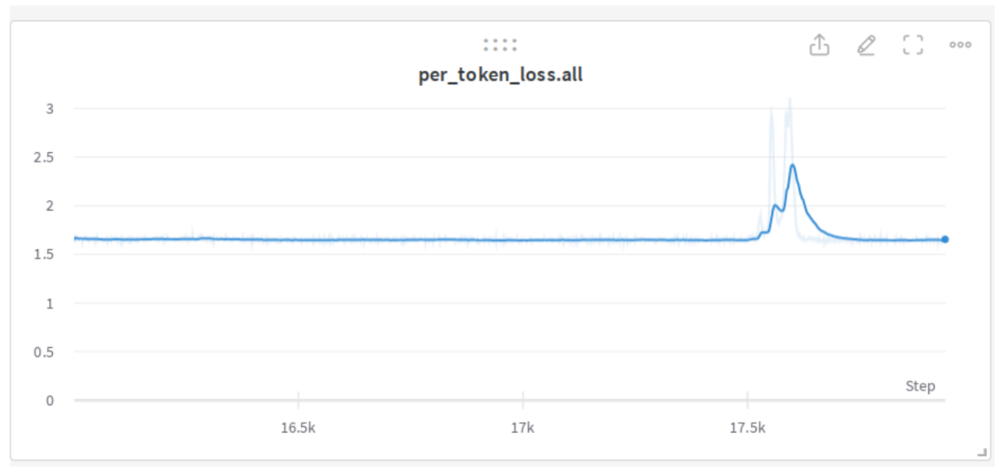


## 未能完全恢复的尖峰

这个 **[1040 亿模型尝试](https://github.com/bigscience-workshop/bigscience/tree/master/train/tr8-104B-wide)** 出现了尖峰，开始恢复，但未能完全恢复，反而开始发散。

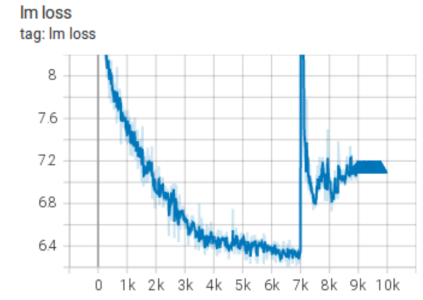


这是 **[IDEFICS-80B 训练](https://github.com/huggingface/m4-logs/blob/master/tr-190-80b/chronicles.md)** 的另一个例子：

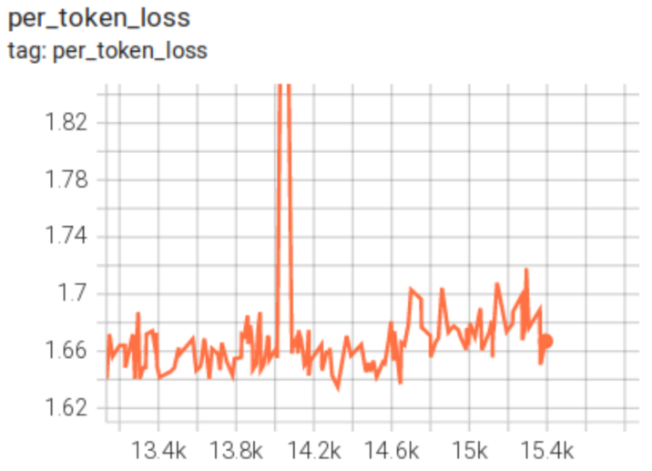

## 非尖峰型发散

下面是一些**没有经过尖峰阶段就直接发散**的例子：


## 多数据集混合导致的尖峰

在 **[IDEFICS-80B 训练](https://github.com/huggingface/m4-logs/blob/master/tr-190-80b/chronicles.md)** 期间，我们混合使用了两种不同的数据集：

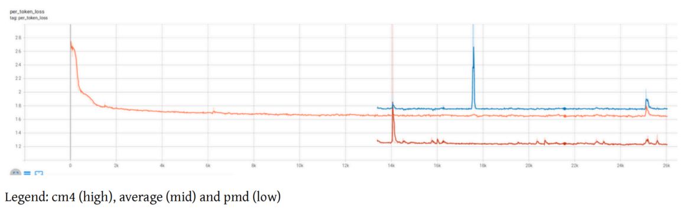

你可以看到，损失尖峰有时同时出现在两个数据集上，有时只出现在其中一个数据集上。

这里模型在学习两种不同的数据分布，你可以看到两个数据分布上的损失和尖峰行为并不相同。pnd 数据集对模型来说比 cm4 容易得多。

## 与训练恢复（Resume）相关的尖峰

由于硬件崩溃，或者因为遇到发散需要回滚到更早的检查点，训练恢复几乎是必然会发生的。如果你的训练软件恢复得不够完美，让模型察觉到"刚刚发生了恢复"，就可能遇到各种问题。

恢复时最复杂的挑战是：恢复各种随机数生成器（RNG）的状态、让 DataLoader 索引回到之前训练的位置、以及处理你特定设置中复杂 DataLoader 的各种其他要求。


### DataSampler 相关问题

在 **IDEFICS-80B 训练** 期间，我们有一个非常复杂的 DataLoader，它在恢复时存在图片到文本比例的波动问题，结果每次恢复都会出现一个小尖峰，然后才恢复：

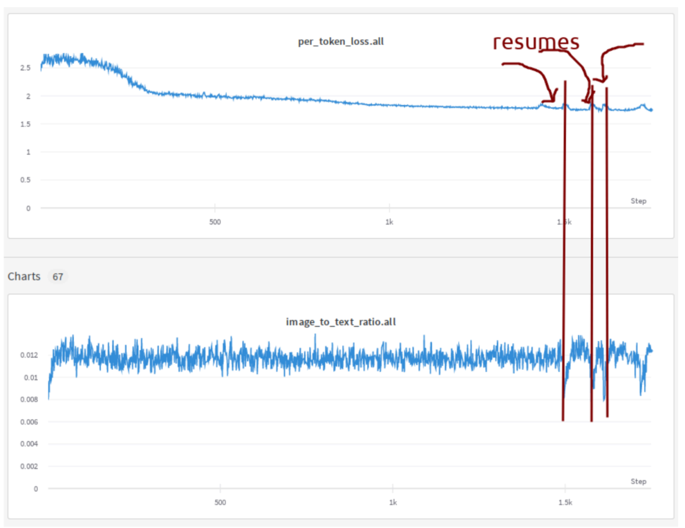

你可以看到损失和比例图之间的相关性。由于我们恢复了大约十几次，所以看到了很多这样的尖峰。


### 重复数据的影响

我在训练一个 Llama2 的变体时，看到了这种非常不寻常的尖峰：它没有发散，也没有恢复，而是**切换到了一个更高的损失水平**：

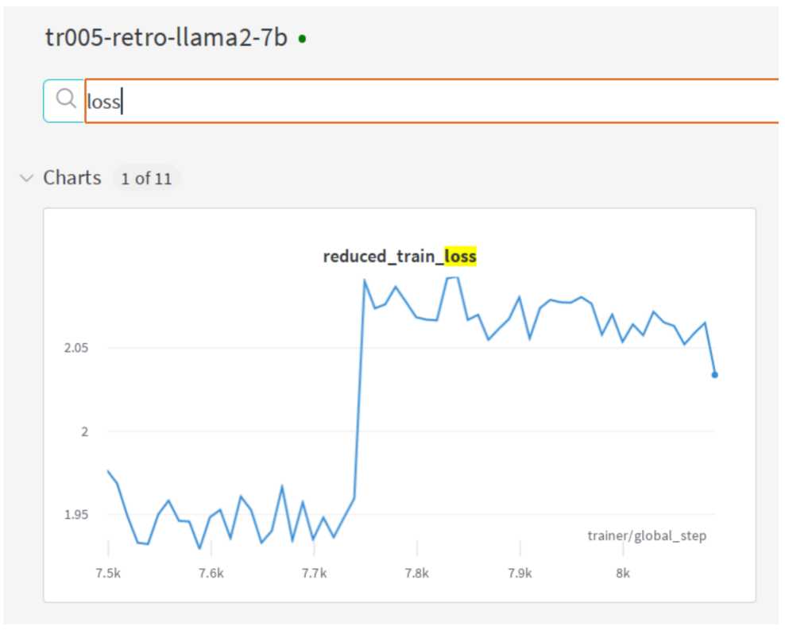

我回滚到异常行为发生之前，然后重启。损失训练在相同的损失水平上继续了一段时间，然后又再次尖峰并切换到了更高的损失水平。

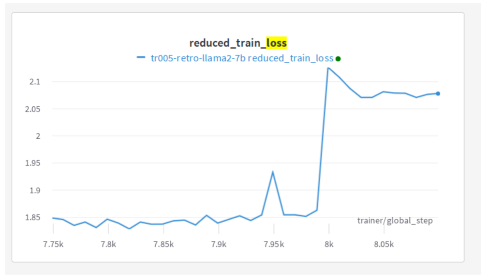

我以前从未见过这种类型的发散。我挠头想了一会儿，然后决定从更大的视角来看。

截至目前，**Wandb** 不能正确处理回滚后的恢复数据绘图——也就是说，如果执行了回滚，它会忽略回滚后的所有新数据，直到旧数据的步数被完全覆盖。这迫使我们每次恢复并回滚时都要开启一个新的 wandb 绘图，才能看到新数据。如果你想看到完整的图，就必须把它们拼接起来，其中包括那些不再有效的死数据点。我做了拼接，然后看到了这个谜团：

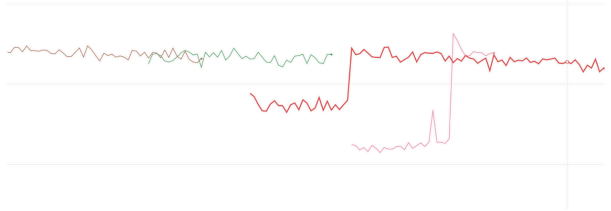

前面两次运行中并没有真正的尖峰。损失根本没有上升。在两次恢复中，由于恰好重复了数据，损失被**低报了**，然后当它遇到之前没见过的数据时，开始正确报告损失。**也就是说，所谓的"回滚"并没有接着之前的数据继续训练，而是从头重新开始了。但问题是，那些旧数据模型已经学过了，所以再次遇到时表现得很好（损失很低），等终于碰到新数据，真实能力才暴露出来——损失一下子跳到了正常水平。**

问题的根源是**数据重复**，而且因为它清楚地记住了其中一部分，所以报告了一个更好的损失。

问题来自 **PyTorch Lightning** 不能正确处理 DataSampler 的自动恢复——基本上每次恢复时，你的数据流都会从头开始。当然，这需要用户想办法解决。你可以改种子来稍微缓解这个问题，避免完全重复的数据序列，但这仍然会让你遇到**重复数据**，
