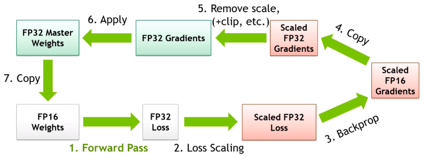

最初，神经网络训练使用的张量类型都是 fp32，但速度慢、占用显存大。此后，NVIDIA 提出了[混合精度训练](https://developer.nvidia.com/blog/video-mixed-precision-techniques-tensor-cores-deep-learning/)，研究人员结合使用 fp16 和 fp32 两种浮点精度格式，这一创新极大地提升了模型训练速度。

---

# 混合精度训练（Mixed Precision Training)

图片中的混合精度训练流程可以概括为以下步骤：

## Step 1：Forward Pass

使用 FP16 weights 进行前向传播。虽然权重和激活可能是 FP16，但 loss 通常会保留为 FP32。

## Step 2：Loss Scaling

对 loss 进行放大。原因是 FP16 能表示的最小数有限，很多小梯度可能会**下溢成 0**。通过把 loss 放大，反向传播得到的梯度也会整体放大，从而避免小梯度丢失。

**反向传播中的梯度和 loss 是线性相关的**[^1]。如果我们把 loss 放大一个倍数，那么反向传播得到的梯度也会被放大同样的倍数。这个值就更容易被 FP16 表示，不容易下溢成 0。

[^1]: 具体见 [Pipeline-Parallelism流水线并行（一）](https://my-webpage-adu.pages.dev/posts/model-parallelism/Pipeline-Parallelism%E6%B5%81%E6%B0%B4%E7%BA%BF%E5%B9%B6%E8%A1%8C%EF%BC%88%E4%B8%80%EF%BC%89/) 中 "GPipe：梯度更新时间" 一节。我总结了梯度运算是线性算子，可以累加。

相比逐个方大所有参数的梯度，直接放大 loss 更加高效。

## Step 3：Backprop

用放大后的 loss 进行反向传播，得到被放大的 FP16 梯度。

## Step 4：Copy

将 FP16 梯度复制或转换为 FP32，从而避免在低精度中做梯度累加和参数更新。

## Step 5：Remove Scale

把梯度缩放还原。**这一步会除以 loss scale**，同时可能进行：

- **检查 Inf / NaN**：如果 scale 太大，梯度可能被放大到超过 FP16 最大范围，导致 Inf / NaN。此时该梯度就不能执行 optimizer step，否则参数会被污染。
- **决定是否跳过 optimizer step**：如果使用了梯度累积（GAS），必须等当前梯度累积周期内所有 micro-batch 的反向传播都完成后，才能执行一次梯度更新
- **动态调整 scale**：scale 足够大，避免 underflow；scale 不要太大，避免 overflow；
- **在 unscale 后做 gradient clipping**：梯度裁剪通过限制梯度的最大范数，防止反向传播中梯度指数爆炸导致训练崩溃

注意，必须**首先进行 Remove Scale**，否则处理的都是放大 scale 倍的梯度，结果会严重错误。

## Step 6：Apply

使用 FP32 gradients 更新 FP32 master weight。这是混合精度训练的关键：虽然计算可以用 FP16，但真正的主权重用 FP32 保存，优化器更新也作用在 FP32 master weights 上。

## Step 7：Copy

把更新后的 FP32 master weights 转回 FP16，用于下一轮前向/反向。

