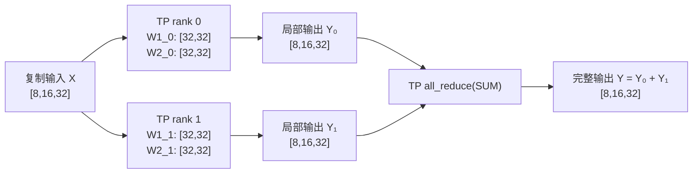
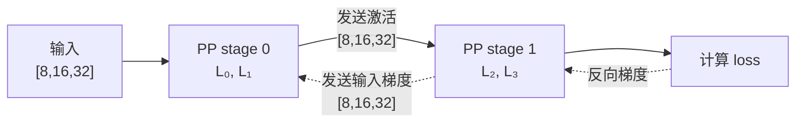
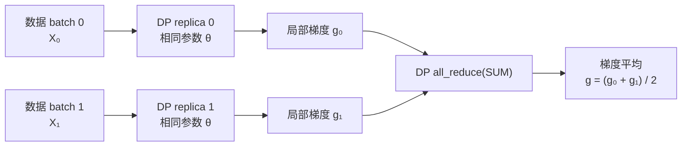
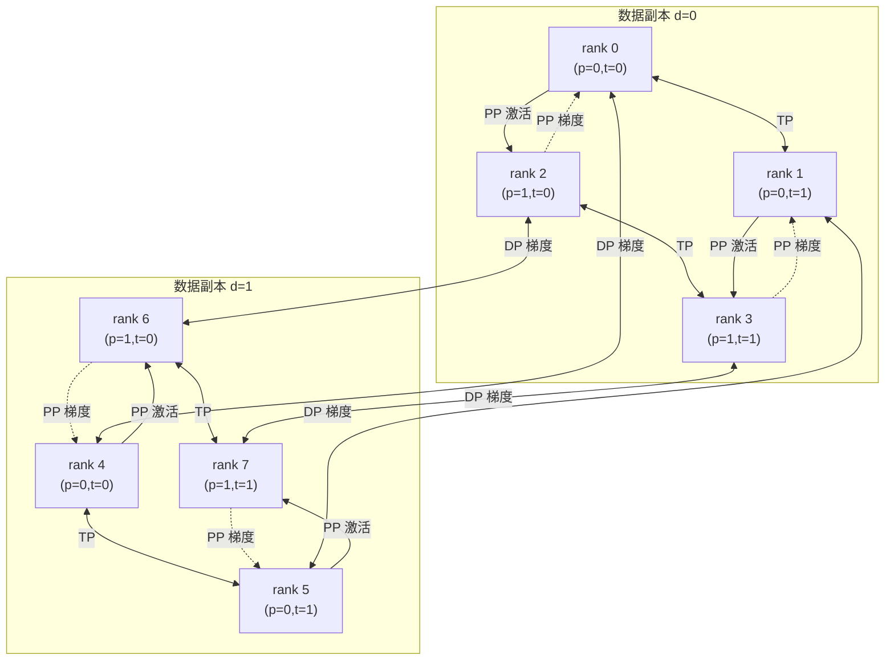

# TP、PP、DP 并行划分与通信

以下均以：

$$
TP=2,\qquad PP=2,\qquad DP=2
$$

为例。测试代码中的主要维度为：

$$
B=8,\qquad S=16,\qquad H=32,\qquad I=64,\qquad L=4
$$

其中 $B$ 为 batch size，$S$ 为序列长度，$H$ 为 hidden size，$I$ 为 intermediate size，$L$ 为层数。

## 1. 单独 TP



输入张量在 TP rank 之间复制：

$$
X\in\mathbb{R}^{B\times S\times H}
=\mathbb{R}^{8\times16\times32}
$$

第一层权重按输出维切分：

$$
W_1\in\mathbb{R}^{I\times H}
=\mathbb{R}^{64\times32}
$$

$$
W_{1,t}\in\mathbb{R}^{I/TP\times H}
=\mathbb{R}^{32\times32}
$$

第二层权重按输入维切分：

$$
W_2\in\mathbb{R}^{H\times I}
=\mathbb{R}^{32\times64}
$$

$$
W_{2,t}\in\mathbb{R}^{H\times I/TP}
=\mathbb{R}^{32\times32}
$$

每个 TP rank 计算局部输出：

$$
Y_t\in\mathbb{R}^{B\times S\times H}
=\mathbb{R}^{8\times16\times32}
$$

然后通过 `all_reduce(SUM)` 得到完整输出：

$$
Y=\sum_{t=0}^{TP-1}Y_t
$$

对应代码：

```python
local_intermediate = intermediate_size // tp_size

column_weight = weight_1[
    group_rank * local_intermediate:
    (group_rank + 1) * local_intermediate
]

row_weight = weight_2[
    :,
    group_rank * local_intermediate:
    (group_rank + 1) * local_intermediate
]

local_output = functional.linear(
    local_activation,
    row_weight,
)

output = _ReduceFromTensorParallel.apply(
    local_output,
    tensor_parallel_group,
    communication,
)
```

- `test_tensor_parallel()` 验证独立 TP；
- `_ReduceFromTensorParallel` 在前向执行 TP `all_reduce`；
- `_CopyToTensorParallel` 在反向汇总输入梯度。

## 2. 单独 PP



4 层网络平均划分到两个 stage：

$$
\text{stage}_0=\{L_0,L_1\}
$$

$$
\text{stage}_1=\{L_2,L_3\}
$$

每个 stage 保存：

$$
L/PP=4/2=2
$$

stage 之间传递的激活形状保持不变：

$$
A\in\mathbb{R}^{B\times S\times H}
=\mathbb{R}^{8\times16\times32}
$$

对应代码：

```python
layers_per_stage = layer_count // pp_size

local_parameters = [
    parameter
    for layer in layers[
        group_rank * layers_per_stage:
        (group_rank + 1) * layers_per_stage
    ]
    for parameter in layer
]
```

前向发送激活：

```python
communication.send(
    stage_outputs.detach(),
    next_stage_rank,
    pipeline_parallel_group,
)
```

反向接收梯度：

```python
output_gradient = communication.receive(
    stage_outputs.shape,
    stage_outputs.dtype,
    next_stage_rank,
    pipeline_parallel_group,
)

stage_outputs.backward(output_gradient)
```

- `test_pipeline_parallel()` 验证独立 PP；
- PP 使用点对点 `send/receive`；
- 最后一个 stage 负责计算 loss；
- 梯度沿相反方向返回前面的 stage。

## 3. 单独 DP



两个 DP 副本使用相同的模型参数，但处理不同的数据：

$$
X_0\ne X_1
$$

每个副本的局部 batch 为：

$$
B_{\text{local}}=8
$$

全局有效 batch 为：

$$
B_{\text{effective}}
=DP\times B_{\text{local}}
=2\times8=16
$$

每个副本得到局部梯度 $g_d$，DP 组内求和后取平均：

$$
g=\frac{1}{DP}\sum_{d=0}^{DP-1}g_d
$$

对应代码：

```python
local_loss = functional.mse_loss(
    forward(local_inputs, parallel_parameters),
    local_targets,
)

local_loss.backward()

for parameter in parallel_parameters:
    communication.all_reduce(
        parameter.grad,
        group=data_parallel_group,
    )
    parameter.grad.div_(dp_size)
```

- `test_data_parallel()` 验证独立 DP；
- DP 只同步梯度，不传输激活；
- 所有 DP 副本从相同初始参数开始。

## 4. TP、PP、DP 联合并行

总进程数为：

$$
WORLD\_SIZE=TP\times PP\times DP
=2\times2\times2=8
$$

全局 rank 映射为：

$$
\mathrm{rank}
=d(PP\times TP)+p\times TP+t
$$

其中：

- $d$：数据并行坐标；
- $p$：流水线 stage 坐标；
- $t$：张量并行坐标。



三类通信组分别为：

$$
\begin{aligned}
TP &: \text{固定 }(d,p)，改变 t\\
PP &: \text{固定 }(d,t)，改变 p\\
DP &: \text{固定 }(p,t)，改变 d
\end{aligned}
$$

对应 rank 分组：

```text
TP: (0,1), (2,3), (4,5), (6,7)
PP: (0,2), (1,3), (4,6), (5,7)
DP: (0,4), (1,5), (2,6), (3,7)
```

### 进程组创建

```python
# TP：固定 (d, p)，改变 t
for d in range(dp_size):
    for p in range(pp_size):
        ranks = [
            d * pp_size * tp_size
            + p * tp_size
            + t
            for t in range(tp_size)
        ]

        group = dist.new_group(ranks)

        if global_rank in ranks:
            tensor_parallel_group = group
```

```python
# PP：固定 (d, t)，改变 p
for d in range(dp_size):
    for t in range(tp_size):
        ranks = [
            d * pp_size * tp_size
            + p * tp_size
            + t
            for p in range(pp_size)
        ]

        group = dist.new_group(ranks)

        if global_rank in ranks:
            pipeline_parallel_group = group
            pipeline_parallel_global_ranks = tuple(ranks)
```

```python
# DP：固定 (p, t)，改变 d
for p in range(pp_size):
    for t in range(tp_size):
        ranks = [
            d * pp_size * tp_size
            + p * tp_size
            + t
            for d in range(dp_size)
        ]

        group = dist.new_group(ranks)

        if global_rank in ranks:
            data_parallel_group = group
```

所有 rank 必须以相同顺序创建这些通信组。

### 联合计算与通信

```python
# TP：复制输入，并在反向时汇总输入梯度
tensor = _CopyToTensorParallel.apply(
    tensor,
    groups.tensor_parallel_group,
    communication,
)

# 当前 TP rank 计算局部参数分片
local_output = functional.linear(
    local_intermediate_output,
    row_weight,
)

# TP：合并局部输出
tensor = _ReduceFromTensorParallel.apply(
    local_output,
    groups.tensor_parallel_group,
    communication,
) + bias_2
```

PP 传递激活和梯度：

```python
communication.send(
    stage_outputs.detach(),
    next_stage_rank,
    groups.pipeline_parallel_group,
)

output_gradient = communication.receive(
    stage_outputs.shape,
    stage_outputs.dtype,
    next_stage_rank,
    groups.pipeline_parallel_group,
)
```

DP 同步相同参数分片的梯度：

```python
for parameter in local_parameters:
    communication.all_reduce(
        parameter.grad,
        group=groups.data_parallel_group,
    )
    parameter.grad.div_(dp_size)
```

联合通信流程为：

$$
\text{TP 局部计算}
\rightarrow
\text{TP 输出归约}
\rightarrow
\text{PP 激活传递}
\rightarrow
\text{PP 梯度传递}
\rightarrow
\text{TP 输入梯度归约}
\rightarrow
\text{DP 梯度平均}
$$

其中：

- TP 负责切分同一层的参数和计算；
- PP 负责切分不同层，并传递中间激活；
- DP 负责复制模型分片，并同步不同数据 batch 产生的梯度。


---

# 实例代码

**`parallel_all_in_one_test.py`:**

```python
r"""使用单机多进程 torchrun 验证并行通信原语。

程序将每个进程视为一个模拟节点，所有进程通过 torchrun 建立的 localhost
TCP store 通信。CUDA 可用时，所有进程刻意在 cuda:0 上执行计算。NCCL 不允许
多个 rank 绑定同一块物理 GPU，因此单卡模拟使用 Gloo 进程组，并将集合通信
数据暂存到 CPU 内存。

示例：
  # 四个进程共享 GPU 0，作为主要单卡验收配置。
  CUDA_VISIBLE_DEVICES=0 torchrun --standalone --nproc_per_node=4 \
      parallel_all_in_one_test.py --tp 2 --pp 2 --dp 1

  # 八个进程的扩展配置，同时覆盖数据并行。
  CUDA_VISIBLE_DEVICES=0 torchrun --standalone --nproc_per_node=8 \
      parallel_all_in_one_test.py --tp 2 --pp 2 --dp 2

  # 仅使用 CPU 的回退配置。
  torchrun --standalone --nproc_per_node=4 \
      parallel_all_in_one_test.py --device cpu --tp 2 --pp 2 --dp 1
"""

from __future__ import annotations

import argparse
import datetime
import os
import pprint
from dataclasses import dataclass
from typing import Sequence

import torch
import torch.distributed as dist
import torch.nn as nn
import torch.nn.functional as functional
import logging

def rank_log(message):
    rank = dist.get_rank() if dist.is_initialized() else 0
    local_rank = int(os.environ.get("LOCAL_RANK", 0))
    print(f"[rank={rank}, local_rank={local_rank}, pid={os.getpid()}] {message}",
          flush=True)


def setup_logging(filemode: str = "a") -> None:
  r"""为当前分布式 rank 配置文件和控制台日志。

  必须在 ``dist.init_process_group()`` 成功后调用，因其依赖全局 rank。

  Args:
    filemode: 日志文件打开模式。``"a"`` 追加到已有日志，``"w"`` 在每次
      启动时覆盖对应 rank 的旧日志。

  Raises:
    ValueError: ``filemode`` 不是 ``"a"`` 或 ``"w"``。
  """
  if filemode not in ("a", "w"):
    raise ValueError("filemode must be either 'a' (append) or 'w' (overwrite).")

  rank = dist.get_rank()

  # 每个 rank 使用独立文件，避免多进程同时写同一日志文件。
  logging.basicConfig(
      filename=f"rank_{rank}.log",
      filemode=filemode,
      level=logging.INFO,
      format="%(asctime)s - %(levelname)s - %(message)s",
  )

  # 同时输出到控制台，便于观察各 rank 的实时状态。
  # 注释下面这段代码就只会打印到日志文件
  console = logging.StreamHandler()
  console.setLevel(logging.INFO)
  formatter = logging.Formatter("%(asctime)s - Rank %(rank)s - %(message)s")
  console.setFormatter(formatter)
  logging.getLogger("").addHandler(console)

  # 为所有日志记录注入当前 rank，供控制台格式化字符串使用。
  old_factory = logging.getLogRecordFactory()

  def record_factory(*args, **kwargs):
    record = old_factory(*args, **kwargs)
    record.rank = rank
    return record

  logging.setLogRecordFactory(record_factory)


@dataclass(frozen=True)
class TestShape:
  r"""所有验证统一使用的小型确定性张量尺寸。

  Attributes:
    hidden_size: Transformer 隐藏层维度。
    intermediate_size: MLP 扩展层维度。
    batch_size: 稠密测试的 batch 维度。
    sequence_length: 稠密测试的序列维度。
    layer_count: 流水线测试的层数。
  """

  hidden_size: int = 32
  intermediate_size: int = 64
  batch_size: int = 8
  sequence_length: int = 16
  layer_count: int = 4


@dataclass(frozen=True)
class ProcessGroups:
  r"""一个全局 rank 对应的进程组和局部坐标。"""

  tensor_parallel_group: dist.ProcessGroup
  pipeline_parallel_group: dist.ProcessGroup
  data_parallel_group: dist.ProcessGroup
  tensor_parallel_rank: int
  pipeline_parallel_rank: int
  data_parallel_rank: int
  pipeline_parallel_global_ranks: tuple[int, ...]


SHAPE = TestShape()


class Communication:
  r"""执行分布式操作，必要时为 Gloo 将 CUDA 数据暂存到 CPU。

  Gloo 支持 localhost 模拟，但只能处理 CPU 张量。该辅助类让计算张量保留在
  指定设备上，仅在 Gloo 通信时透明地将集合通信和点对点数据复制到 CPU。
  """

  def __init__(self, backend: str, device: torch.device):
    r"""初始化通信适配器。

    Args:
      backend: 已初始化的 PyTorch 分布式后端。
      device: 数学测试计算所使用的设备。
    """
    self._backend = backend
    self._device = device
    self._stage_through_cpu = backend == "gloo" and device.type == "cuda"

  def _to_communication_device(self, tensor: torch.Tensor) -> torch.Tensor:
    r"""返回位于通信后端设备上的脱离计算图的集合通信数据。
    函数名前的 _ 是 Python 的约定：表示“内部实现细节 / 非公开 API”。
    """
    if self._stage_through_cpu:
      return tensor.detach().to("cpu")
    return tensor.detach()

  def _to_compute_device(self, tensor: torch.Tensor) -> torch.Tensor:
    r"""将接收到的数据返回到配置的计算设备。"""
    if self._stage_through_cpu:
      return tensor.to(self._device)
    return tensor

  def all_reduce(
      self,
      tensor: torch.Tensor,
      op: dist.ReduceOp = dist.ReduceOp.SUM,
      group: dist.ProcessGroup | None = None,
  ) -> None:
    r"""对计算张量执行原地 all-reduce。

    例如 TP=2 时，两个 rank 分别得到 ``[8, 16, 32]`` 的局部线性输出；
    SUM 后两者都持有同一个完整 ``[8, 16, 32]`` 输出。DP 中同一调用则将
    两份同形参数梯度相加，调用方再除以组大小得到平均梯度。

    Args:
      tensor: 每个组内 rank 均持有、且形状相同的计算张量。
      op: 归约操作；默认 SUM。
      group: 要参与通信的进程组；省略时使用全局组。
    """
    communication_tensor = self._to_communication_device(tensor)
    dist.all_reduce(communication_tensor, op=op, group=group)
    if self._stage_through_cpu:
      tensor.copy_(self._to_compute_device(communication_tensor))

  def send(
      self, tensor: torch.Tensor, destination_rank: int, group: dist.ProcessGroup
  ) -> None:
    r"""向进程组中的指定全局 rank 发送计算张量。

    PP 前向发送 stage 的激活值，例如 ``[8, 16, 32]``；反向发送同形的
    ``dL/dactivation``。发送方必须与接收方按相同 stage 顺序配对。
    """
    dist.send(
        self._to_communication_device(tensor).contiguous(),
        dst=destination_rank,
        group=group,
    )

  def receive(
      self,
      shape: Sequence[int],
      dtype: torch.dtype,
      source_rank: int,
      group: dist.ProcessGroup,
  ) -> torch.Tensor:
    r"""从指定全局 rank 接收给定形状的张量，并放到计算设备上。

    Args:
      shape: 接收张量的已知形状，例如 PP 激活的 ``[8, 16, 32]``。
      dtype: 接收张量的数据类型。
      source_rank: 发送方的全局 rank。
      group: 包含发送方和接收方的进程组。
    """
    communication_device = "cpu" if self._stage_through_cpu else self._device
    received = torch.empty(shape, dtype=dtype, device=communication_device)
    dist.recv(received, src=source_rank, group=group)
    return self._to_compute_device(received)


class _ReduceFromTensorParallel(torch.autograd.Function):
  r"""合并行并行前向输出，反向将完整输出梯度交给本地分片。

  对 ``Y_t = A_t @ W2_t.T``，每个 TP rank 的 ``Y_t`` 均为 ``[8, 16, 32]``。
  前向 all-reduce 得到 ``Y = sum_t(Y_t)``。反向的 ``dL/dY`` 已是完整输出的
  梯度，每个 ``Y_t`` 都需要同一份梯度来计算自己的 ``W2_t`` 梯度，因此无需
  再次求和。
  """

  @staticmethod
  def forward(
      ctx: torch.autograd.function.FunctionCtx,
      tensor: torch.Tensor,
      group: dist.ProcessGroup,
      communication: Communication,
  ) -> torch.Tensor:
    r"""对本地前向贡献执行 all-reduce。"""
    del ctx
    result = tensor.clone()
    communication.all_reduce(result, group=group, op=dist.ReduceOp.SUM)
    return result

  @staticmethod
  def backward(
      ctx: torch.autograd.function.FunctionCtx,
      gradient: torch.Tensor
  ) -> tuple[torch.Tensor, None, None]:
    r"""返回本地梯度贡献，不再执行集合通信。"""
    del ctx
    return gradient, None, None


class _CopyToTensorParallel(torch.autograd.Function):
  r"""在前向复制输入，并在反向汇总各 TP 分片的输入梯度。

  列并行层的每个分片都读取完整输入 ``X: [8, 16, 32]``。各分片反向得到的
  ``dL/dX_t`` 只是对输入梯度的部分贡献，故必须 all-reduce 成
  ``dL/dX = sum_t(dL/dX_t)``，才能传给前一层或前一 PP stage。
  """

  @staticmethod
  def forward(
      ctx: torch.autograd.function.FunctionCtx,
      tensor: torch.Tensor,
      group: dist.ProcessGroup,
      communication: Communication,
  ) -> torch.Tensor:
    r"""向每个 TP rank 提供相同输入；前向无需通信。"""
    ctx.group = group
    ctx.communication = communication
    return tensor

  @staticmethod
  def backward(
      ctx: torch.autograd.function.FunctionCtx, gradient: torch.Tensor
  ) -> tuple[torch.Tensor, None, None]:
    r"""汇总列并行分片对复制输入产生的局部梯度。"""
    result = gradient.clone()
    ctx.communication.all_reduce(result, group=ctx.group)
    return result, None, None


def rank_zero_log(message: str) -> None:
  r"""仅由全局 rank 0 打印消息。"""
  if dist.get_rank() == 0:
    print(message, flush=True)


def tensors_close(
    actual: torch.Tensor,
    expected: torch.Tensor,
    relative_tolerance: float = 1e-4,
    absolute_tolerance: float = 1e-5,
) -> bool:
  r"""判断两个张量是否在确定性测试容差内一致。"""
  return torch.allclose(
      actual,
      expected,
      rtol=relative_tolerance,
      atol=absolute_tolerance,
  )


def gradient_or_zeros(parameter: nn.Parameter) -> torch.Tensor:
  r"""返回参数梯度；若 autograd 未生成梯度则返回同形状零张量。"""
  return parameter.grad if parameter.grad is not None else torch.zeros_like(parameter)


def check_all_ranks(
    name: str, passed: bool, device: torch.device, communication: Communication
) -> bool:
  r"""要求所有 rank 都通过检查，并由 rank 0 报告结果。"""
  result = torch.tensor([float(passed)], device=device)
  # 如果有某个 rank 没通过检查， all-reduce 的最小值就是 0。
  communication.all_reduce(result, op=dist.ReduceOp.MIN)
  globally_passed = result.item() == 1.0
  # rank_zero_log(f"[{'PASS' if globally_passed else 'FAIL'}] {name}")
  return globally_passed


def make_linear_parameters(
    output_features: int,
    input_features: int,
    seed: int,
    device: torch.device,
) -> tuple[torch.Tensor, torch.Tensor]:
  r"""创建可复现的随机线性层参数。

  Args:
    output_features: PyTorch 权重的输出特征维度。
    input_features: PyTorch 权重的输入特征维度。
    seed: 用于多 rank 可重复初始化的随机种子。
    device: 参数所在的计算设备。

  Returns:
    形状为 ``[output_features, input_features]`` 的权重，以及形状为
    ``[output_features]`` 的偏置。
  """
  return (
      make_tensor((output_features, input_features), seed, device, std=0.2),
      make_tensor((output_features,), seed + 10_000, device, std=0.1),
  )


def make_tensor(
    shape: Sequence[int], seed: int, device: torch.device, std: float = 1.0
) -> torch.Tensor:
  r"""在 device 上创建可复现的正态分布随机张量。

  同一 ``seed`` 在所有 rank 上生成相同值；DP 测试通过为不同 data rank
  选择不同 seed，模拟不同数据 batch。
  """
  generator = torch.Generator().manual_seed(seed)
  return (torch.randn(*shape, generator=generator) * std).to(device)


def test_tensor_parallel(
    group: dist.ProcessGroup,
    group_rank: int,
    group_size: int,
    device: torch.device,
    communication: Communication,
) -> bool:
  r"""验证 TP MLP 的推理和训练结果与未切分模型一致。

  以 ``hidden=32``、``intermediate=64``、``tp=2`` 为例，输入 ``X`` 的形状
  为 ``[8, 16, 32]``。rank 0 保存 ``W1[0:32, :]`` 与 ``W2[:, 0:32]``，
  rank 1 保存其余切片；两者各自产生 ``[8, 16, 32]`` 局部输出后 all-reduce，
  恢复完整 MLP 输出。反向时每个 rank 只得到自己参数切片的梯度。

  Args:
    group: 固定 ``(d, p)`` 的 TP 进程组。
    group_rank: 当前 rank 在 TP 组中的 ``t`` 坐标。
    group_size: TP 大小。
    device: 计算设备。
    communication: 集合通信适配器。

  Returns:
    所有 rank 的前向、loss 与局部参数梯度是否匹配稠密参考。
  """
  weight_1, bias_1 = make_linear_parameters(
      SHAPE.intermediate_size, SHAPE.hidden_size, 11, device
  )
  weight_2, bias_2 = make_linear_parameters(
      SHAPE.hidden_size, SHAPE.intermediate_size, 12, device
  )
  inputs = make_tensor(
      (SHAPE.batch_size, SHAPE.sequence_length, SHAPE.hidden_size), 13, device
  )
  targets = make_tensor(inputs.shape, 14, device, std=0.5)
  local_intermediate = SHAPE.intermediate_size // group_size
  logging.info(f"tp_weight1:{weight_1.shape}, tp_weight2:{weight_2.shape}, tp_bias1:{bias_1.shape}, "
               f"tp_bias2:{bias_2.shape}")
  logging.info(f"tp_inputs:{inputs.shape}, tp_targets:{targets.shape}")
  # 列并行切分中间输出维：W1 为 [64, 32]，TP=2 时每个 rank 取 [32, 32]。
  # 因而每个 rank 都读取完整 X:[8, 16, 32]，但仅计算 32 个中间特征。
  column_weight = nn.Parameter(
      weight_1[group_rank * local_intermediate:(group_rank + 1) * local_intermediate]
      .clone()
  )
  column_bias = nn.Parameter(
      bias_1[group_rank * local_intermediate:(group_rank + 1) * local_intermediate]
      .clone()
  )
  # 行并行切分 W2 的输入维：W2 为 [32, 64]，每个 rank 只消费自己的 32 个
  # 中间特征，局部线性输出仍是 [8, 16, 32]，需要与其他分片相加。
  row_weight = nn.Parameter(
      weight_2[:, group_rank * local_intermediate:(group_rank + 1) * local_intermediate]
      .clone()
  )
  logging.info(f"tp_column_weight:{column_weight.shape}, tp_column_bias:{column_bias.shape}")
  logging.info(f"tp_row_weight:{row_weight.shape}")

  def parallel_forward(tensor: torch.Tensor) -> torch.Tensor:
    # A_t = GELU(X @ W1_t.T + b1_t)，形状为 [8, 16, 32]。
    local_activation = functional.gelu(
        functional.linear(tensor, column_weight, column_bias)
    )
    # Y_t = A_t @ W2_t.T 是完整输出的一部分；all-reduce 后
    # Y = Y_0 + Y_1，两个 TP rank 都得到相同的 [8, 16, 32]。
    local_output = functional.linear(local_activation, row_weight)
    return _ReduceFromTensorParallel.apply(local_output, group, communication) + bias_2

  reference_parameters = [
      nn.Parameter(weight_1.clone()),
      nn.Parameter(bias_1.clone()),
      nn.Parameter(weight_2.clone()),
      nn.Parameter(bias_2.clone()),
  ]

  def reference_forward(tensor: torch.Tensor) -> torch.Tensor:
    return functional.linear(
        functional.gelu(
            functional.linear(
                tensor, reference_parameters[0], reference_parameters[1]
            )
        ),
        reference_parameters[2],
        reference_parameters[3],
    )

  with torch.no_grad():
    inference_matches = tensors_close(parallel_forward(inputs), reference_forward(inputs))
  parallel_loss = functional.mse_loss(parallel_forward(inputs), targets)
  # _ReduceFromTensorParallel 的反向将完整 dL/dY 交给每个 W2 分片，
  # 所以各 rank 可独立求 W1_t、b1_t、W2_t 的局部梯度。
  parallel_loss.backward()
  reference_loss = functional.mse_loss(reference_forward(inputs), targets)
  reference_loss.backward()

  training_matches = (
      tensors_close(parallel_loss.detach(), reference_loss.detach())
      and tensors_close(
          gradient_or_zeros(column_weight),
          gradient_or_zeros(reference_parameters[0])[group_rank * local_intermediate:
                                                   (group_rank + 1) * local_intermediate],
      )
      and tensors_close(
          gradient_or_zeros(column_bias),
          gradient_or_zeros(reference_parameters[1])[group_rank * local_intermediate:
                                                   (group_rank + 1) * local_intermediate],
      )
      and tensors_close(
          gradient_or_zeros(row_weight),
          gradient_or_zeros(reference_parameters[2])[:,
                                                      group_rank * local_intermediate:
                                                      (group_rank + 1) * local_intermediate],
      )
  )
  return (
      check_all_ranks(
          "TP: inference forward matches dense reference",
          inference_matches,
          device,
          communication,
      )
      and check_all_ranks(
          "TP: training loss and gradients match dense reference",
          training_matches,
          device,
          communication,
      )
  )


def test_pipeline_parallel(
    group: dist.ProcessGroup,
    group_rank: int,
    group_size: int,
    global_ranks: Sequence[int],
    device: torch.device,
    communication: Communication,
) -> bool:
  r"""验证 PP 分 stage 的同步推理和训练。

  ``layer_count=4`` 且 PP=2 时，stage 0、1 各持有两层 32 -> 64 -> 32 MLP。
  stage 0 将 ``[8, 16, 32]`` 激活发送给 stage 1；末 stage 计算 loss 后把同形
  激活梯度传回。每个 stage 只保存本层参数，因此通信的是激活值和梯度而非参数。

  Args:
    group: 固定 ``(d, t)`` 的 PP 进程组。
    group_rank: 当前 stage 的 ``p`` 坐标。
    group_size: PP stage 数。
    global_ranks: 按 stage 排序的 PP 组全局 rank。
    device: 计算设备。
    communication: 点对点和集合通信适配器。

  Returns:
    PP 推理、loss 与本 stage 参数梯度是否匹配稠密参考。
  """
  layers = [
      (*make_linear_parameters(SHAPE.intermediate_size, SHAPE.hidden_size, 300 + index, device),
       *make_linear_parameters(SHAPE.hidden_size, SHAPE.intermediate_size, 400 + index, device))
      for index in range(SHAPE.layer_count)
  ]
  logging.info(f"pp_layers: {[j.shape for l in layers for j in l]}")
  # logging.info(len(layers))
  inputs = make_tensor(
      (SHAPE.batch_size, SHAPE.sequence_length, SHAPE.hidden_size), 41, device
  )
  logging.info(f"pp_inputs: {inputs.shape}")
  targets = make_tensor(inputs.shape, 42, device, std=0.5)
  logging.info(f"pp_targets: {targets.shape}")
  layers_per_stage = SHAPE.layer_count // group_size
  # PP=2 时 group_rank=0 取层 0、1，group_rank=1 取层 2、3；每层参数在
  # 本 stage 内连续保存，避免其他 stage 持有不必要的模型参数。
  local_parameters = [
      nn.Parameter(tensor.clone())
      for layer in layers[group_rank * layers_per_stage:(group_rank + 1) * layers_per_stage]
      for tensor in layer
  ]
  logging.info(f"pp_local_parameters: {[p.shape for p in local_parameters]}")

  def stage_forward(tensor: torch.Tensor) -> torch.Tensor:
    for layer_index in range(layers_per_stage):
      weight_1, bias_1, weight_2, bias_2 = local_parameters[
          4 * layer_index:4 * layer_index + 4
      ]
      tensor = functional.linear(
          functional.gelu(functional.linear(tensor, weight_1, bias_1)), weight_2, bias_2
      )
    return tensor

  reference_parameters = [
      nn.Parameter(tensor.clone()) for layer in layers for tensor in layer
  ]

  def reference_forward(tensor: torch.Tensor) -> torch.Tensor:
    for layer_index in range(SHAPE.layer_count):
      weight_1, bias_1, weight_2, bias_2 = reference_parameters[
          4 * layer_index:4 * layer_index + 4
      ]
      tensor = functional.linear(
          functional.gelu(functional.linear(tensor, weight_1, bias_1)), weight_2, bias_2
      )
    return tensor

  pipeline_input: torch.Tensor | None = None
  if group_rank == 0:
    # 第一个 stage 直接使用本地 batch 的 [8,16,32] 输入。
    activations = inputs
  else:
    # 后续 stage 接收前一 stage 的 detached 激活。recv 脱离了前一进程的
    # autograd 图，必须 requires_grad_，才能得到需回传的 dL/dactivation。
    activations = communication.receive(
        inputs.shape, inputs.dtype, global_ranks[group_rank - 1], group
    )
    activations.requires_grad_(True)
    pipeline_input = activations

  stage_outputs = stage_forward(activations)
  local_loss = float("-inf")
  logging.info(f"pp_group_rank: {group_rank}")
  if group_rank < group_size - 1:
    # 前向：把本 stage 的 [8,16,32] 输出送到下一 stage。
    # 反向：等待下一 stage 算出的同形梯度，再以它为 seed 对本 stage 输出执行 backward。
    communication.send(stage_outputs.detach(), global_ranks[group_rank + 1], group)
    output_gradient = communication.receive(
        stage_outputs.shape, stage_outputs.dtype, global_ranks[group_rank + 1], group
    )
    stage_outputs.backward(output_gradient)
    if pipeline_input is not None:
      # 将 dL/d(本 stage 输入) 传给前一 stage，使其继续计算自己的参数梯度。
      communication.send(pipeline_input.grad, global_ranks[group_rank - 1], group)
  else:
    # 只有末 stage 同时拥有完整输出和 targets，负责产生标量 loss 与初始梯度。
    loss = functional.mse_loss(stage_outputs, targets)
    loss.backward()
    local_loss = loss.item()
    if pipeline_input is not None:
      communication.send(pipeline_input.grad, global_ranks[group_rank - 1], group)

  with torch.no_grad():
    if group_rank == 0:
      inference_activations = inputs
    else:
      inference_activations = communication.receive(
          inputs.shape, inputs.dtype, global_ranks[group_rank - 1], group
      )
    inference_outputs = stage_forward(inference_activations)
    if group_rank < group_size - 1:
      communication.send(inference_outputs, global_ranks[group_rank + 1], group)

  reference_outputs = reference_forward(inputs)
  reference_loss = functional.mse_loss(reference_outputs, targets)
  reference_loss.backward()
  loss_tensor = torch.tensor([local_loss], device=device)
  # 只有末 stage 的 local_loss 有效；MAX 将该标量传播到整个 PP 组用于日志与
  # 数值对比，非末 stage 的 -inf 不会影响结果。
  communication.all_reduce(loss_tensor, op=dist.ReduceOp.MAX)
  # rank_zero_log(
  #     f"      PP loss={loss_tensor.item():.6f} reference={reference_loss.item():.6f}"
  # )
  gradient_matches = all(
      tensors_close(
          gradient_or_zeros(local_parameters[index]),
          gradient_or_zeros(reference_parameters[group_rank * layers_per_stage * 4 + index]),
      )
      for index in range(4 * layers_per_stage)
  )
  inference_matches = True
  loss_matches = True
  if group_rank == group_size - 1:
    inference_matches = tensors_close(inference_outputs, reference_outputs.detach())
    loss_matches = tensors_close(loss_tensor, reference_loss.detach().reshape(1))
  return (
      check_all_ranks(
          "PP: inference forward matches dense reference",
          inference_matches,
          device,
          communication,
      )
      and check_all_ranks(
          "PP: loss and every stage gradient match dense reference",
          gradient_matches and loss_matches,
          device,
          communication,
      )
  )


def test_data_parallel(
    group: dist.ProcessGroup,
    group_rank: int,
    group_size: int,
    device: torch.device,
    communication: Communication,
) -> bool:
  r"""验证 DP 副本的梯度平均等于多 batch 稠密参考。

  每个 DP rank 保存相同的 32 -> 64 -> 32 MLP，却使用不同 seed 生成不同的
  ``inputs:[8,16,32]`` 和 targets。各自反向得到同形参数梯度，例如
  ``W1.grad:[64,32]``；DP all-reduce 后除以 DP 大小，得到所有本地 batch
  的平均梯度，正是一次更大 batch 训练应使用的梯度。

  Args:
    group: 固定 ``(p, t)`` 的 DP 进程组。
    group_rank: 当前数据副本的 ``d`` 坐标。
    group_size: DP 副本数。
    device: 计算设备。
    communication: 集合通信适配器。

  Returns:
    平均后的每个参数梯度是否匹配参考结果。
  """
  weight_1, bias_1 = make_linear_parameters(
      SHAPE.intermediate_size, SHAPE.hidden_size, 51, device
  )
  weight_2, bias_2 = make_linear_parameters(
      SHAPE.hidden_size, SHAPE.intermediate_size, 52, device
  )

  def make_parameters() -> list[nn.Parameter]:
    return [nn.Parameter(value.clone()) for value in (weight_1, bias_1, weight_2, bias_2)]

  def forward(tensor: torch.Tensor, parameters: Sequence[nn.Parameter]) -> torch.Tensor:
    return functional.linear(
        functional.gelu(functional.linear(tensor, parameters[0], parameters[1])),
        parameters[2],
        parameters[3],
    )

  parallel_parameters = make_parameters()
  logging.info(f"dp_parallel_parameters: {[p.shape for p in parallel_parameters]}")
  # d=0、d=1 等副本使用不同 batch，但从相同初始参数开始。如果初始参数不同，相当于是在同时训练多个模型，逻辑错误。
  local_inputs = make_tensor(
      (SHAPE.batch_size, SHAPE.sequence_length, SHAPE.hidden_size),
      3000 + group_rank, device
  )
  local_targets = make_tensor(local_inputs.shape, 4000 + group_rank, device, std=0.5)
  local_loss = functional.mse_loss(forward(local_inputs, parallel_parameters), local_targets)
  local_loss.backward()
  for parameter in parallel_parameters:
    # 同一参数分片的每个副本贡献一个局部梯度。SUM 后除以 group_size，
    # 使学习率语义与“所有 batch 梯度取平均”保持一致。
    communication.all_reduce(parameter.grad, group=group)
    parameter.grad.div_(group_size)

  reference_parameters = make_parameters()
  accumulated_gradients = [torch.zeros_like(parameter) for parameter in reference_parameters]
  for rank in range(group_size):
    # 参考模型串行处理所有 DP batch，并显式累计梯度；它不使用任何通信。
    for parameter in reference_parameters:
      parameter.grad = None
    batch_inputs = make_tensor(local_inputs.shape, 3000 + rank, device)
    batch_targets = make_tensor(local_inputs.shape, 4000 + rank, device, std=0.5)
    functional.mse_loss(forward(batch_inputs, reference_parameters), batch_targets).backward()
    for accumulated, parameter in zip(accumulated_gradients, reference_parameters):
      accumulated.add_(parameter.grad)
  gradients_match = all(
      tensors_close(gradient_or_zeros(parameter), accumulated / group_size)
      for parameter, accumulated in zip(parallel_parameters, accumulated_gradients)
  )
  maximum_loss = torch.tensor([local_loss.item()], device=device)
  communication.all_reduce(maximum_loss, op=dist.ReduceOp.MAX)
  # rank_zero_log(
  #     f"      DP maximum local loss={maximum_loss.item():.6f} (batches differ by rank)"
  # )
  return check_all_ranks(
      "DP: averaged gradients match all-batch reference",
      gradients_match,
      device,
      communication,
  )


def test_combined_parallel(
    groups: ProcessGroups,
    tp_size: int,
    pp_size: int,
    dp_size: int,
    device: torch.device,
    communication: Communication,
) -> bool:
  r"""端到端验证 TP、PP、DP 组合训练与稠密参考结果一致。

  以 TP=2、PP=2、DP=2 为例，rank ``(d, p, t)`` 在 stage ``p`` 内保存
  ``W1`` 的第 ``t`` 个行切片和 ``W2`` 的第 ``t`` 个列切片。两个 TP 分片
  先 all-reduce 合并为 ``[8,16,32]`` 激活，再沿同一 ``(d,t)`` PP 链路传给
  下一 stage。反向时列并行输入梯度在 TP 组内求和，PP 将该完整梯度传回前一
  stage，最后同一 ``(p,t)`` 的两个 DP 副本平均参数梯度。

  参考模型在单个 rank 上依次处理所有 DP batch，并将梯度平均后与各 stage、
  各 TP 分片的本地梯度进行比较。

  Args:
    groups: 当前全局 rank 对应的 TP、PP、DP 进程组及局部坐标。
    tp_size: 张量并行维度大小。
    pp_size: 流水线并行维度大小。
    dp_size: 数据并行维度大小。
    device: 计算设备。
    communication: 分布式通信适配器。

  Returns:
    所有 rank 上的组合前向、loss 和梯度检查是否都通过。
  """
  global_rank = dist.get_rank()
  tensor_rank = groups.tensor_parallel_rank
  pipeline_rank = groups.pipeline_parallel_rank
  data_rank = groups.data_parallel_rank
  layers_per_stage = SHAPE.layer_count // pp_size
  local_intermediate = SHAPE.intermediate_size // tp_size

  layers = [
      (
          *make_linear_parameters(
              SHAPE.intermediate_size, SHAPE.hidden_size, 600 + index, device
          ),
          *make_linear_parameters(
              SHAPE.hidden_size, SHAPE.intermediate_size, 700 + index, device
          ),
      )
      for index in range(SHAPE.layer_count)
  ]
  logging.info(f"combined_layers: {[j.shape for l in layers for j in l]}")
  stage_start = pipeline_rank * layers_per_stage
  stage_layers = layers[stage_start:stage_start + layers_per_stage]
  local_parameters: list[nn.Parameter] = []
  for weight_1, bias_1, weight_2, bias_2 in stage_layers:
    # 每个 PP stage 只切自己的层。TP=2 时 W1:[64,32] 沿第 0 维变为两个
    # [32,32]，W2:[32,64] 沿第 1 维变为两个 [32,32]；b2:[32] 在 TP 内复制。
    local_parameters.extend([
        nn.Parameter(
            weight_1[
                tensor_rank * local_intermediate:(tensor_rank + 1) * local_intermediate
            ].clone()
        ),
        nn.Parameter(
            bias_1[
                tensor_rank * local_intermediate:(tensor_rank + 1) * local_intermediate
            ].clone()
        ),
        nn.Parameter(
            weight_2[
                :, tensor_rank * local_intermediate:(tensor_rank + 1) * local_intermediate
            ].clone()
        ),
        nn.Parameter(bias_2.clone()),
    ])
  logging.info(f"combined_local_parameters: {[p.shape for p in local_parameters]}")

  def stage_forward(tensor: torch.Tensor) -> torch.Tensor:
    for layer_index in range(layers_per_stage):
      weight_1, bias_1, weight_2, bias_2 = local_parameters[
          4 * layer_index:4 * layer_index + 4
      ]
      # 每个 TP rank 都需要完整 [8,16,32] 输入来计算自己的 W1 行切片。
      # 反向由 Copy 原语 all-reduce 局部 dL/dinput，避免把不完整梯度传给
      # 前一层或前一 PP stage。
      tensor = _CopyToTensorParallel.apply(
          tensor, groups.tensor_parallel_group, communication
      )
      local_intermediate_output = functional.gelu(
          functional.linear(tensor, weight_1, bias_1)
      )
      local_output = functional.linear(local_intermediate_output, weight_2)
      # 两个 [8,16,32] 局部 W2 输出相加后才是完整 layer 输出；该张量可被
      # 下一 TP 层复制使用，或由 PP send 交给下一 stage。
      tensor = _ReduceFromTensorParallel.apply(
          local_output, groups.tensor_parallel_group, communication
      ) + bias_2
    return tensor

  inputs = make_tensor(
      (SHAPE.batch_size, SHAPE.sequence_length, SHAPE.hidden_size),
      1000 + data_rank,
      device,
  )
  targets = make_tensor(inputs.shape, 2000 + data_rank, device, std=0.5)
  pipeline_input: torch.Tensor | None = None
  if pipeline_rank == 0:
    # 同一 DP 副本的两个 t 坐标生成同一个输入，确保 TP 分片处理同一 batch。
    activations = inputs
  else:
    # PP 只连接相同 (d,t) 的相邻 stage。接收值脱离远端 autograd 图，需要
    # 打开 requires_grad 以取得要发送回去的完整 dL/dactivation。
    activations = communication.receive(
        inputs.shape,
        inputs.dtype,
        groups.pipeline_parallel_global_ranks[pipeline_rank - 1],
        groups.pipeline_parallel_group,
    )
    activations.requires_grad_(True)
    pipeline_input = activations
  stage_outputs = stage_forward(activations)

  local_loss = None
  if pipeline_rank < pp_size - 1:
    # 前向发送合并后的激活；反向接收下一 stage 对该激活的梯度。此梯度经过
    # 下一 stage 的 _CopyToTensorParallel 反向 all-reduce，已包含所有 TP
    # 分片贡献，因此可直接作为本 stage backward 的 seed。
    communication.send(
        stage_outputs.detach(),
        groups.pipeline_parallel_global_ranks[pipeline_rank + 1],
        groups.pipeline_parallel_group,
    )
    output_gradient = communication.receive(
        stage_outputs.shape,
        stage_outputs.dtype,
        groups.pipeline_parallel_global_ranks[pipeline_rank + 1],
        groups.pipeline_parallel_group,
    )
    stage_outputs.backward(output_gradient)
    if pipeline_input is not None:
      communication.send(
          pipeline_input.grad,
          groups.pipeline_parallel_global_ranks[pipeline_rank - 1],
          groups.pipeline_parallel_group,
      )
  else:
    # 末 PP stage 的每个 TP rank 都持有相同完整输出，故可计算同一个本地 loss；
    # TP 参数不同，反向会分别得到各自参数切片的梯度。
    local_loss = functional.mse_loss(stage_outputs, targets)
    local_loss.backward()
    if pipeline_input is not None:
      communication.send(
          pipeline_input.grad,
          groups.pipeline_parallel_global_ranks[pipeline_rank - 1],
          groups.pipeline_parallel_group,
      )

  with torch.no_grad():
    reference_inputs = [
        make_tensor(
            (SHAPE.batch_size, SHAPE.sequence_length, SHAPE.hidden_size),
            1000 + rank,
            device,
        )
        for rank in range(dp_size)
    ]
    reference_targets = [
        make_tensor(reference_inputs[rank].shape, 2000 + rank, device, std=0.5)
        for rank in range(dp_size)
    ]
  reference_parameters = [
      nn.Parameter(tensor.clone()) for layer in layers for tensor in layer
  ]

  def reference_forward(tensor: torch.Tensor) -> torch.Tensor:
    for layer_index in range(SHAPE.layer_count):
      weight_1, bias_1, weight_2, bias_2 = reference_parameters[
          4 * layer_index:4 * layer_index + 4
      ]
      tensor = functional.linear(
          functional.gelu(functional.linear(tensor, weight_1, bias_1)),
          weight_2,
          bias_2,
      )
    return tensor

  reference_outputs = []
  for reference_input, reference_target in zip(reference_inputs, reference_targets):
    reference_output = reference_forward(reference_input)
    reference_outputs.append(reference_output.detach())
    functional.mse_loss(reference_output, reference_target).backward()
  for parameter in reference_parameters:
    parameter.grad.div_(dp_size)

  for parameter in local_parameters:
    # 组固定 (p,t)；这里同步的是同一 stage、同一 TP 参数切片在不同 d 上的
    # 梯度，而不是不同 TP 分片之间的梯度。SUM / dp_size 得到 batch 平均值。
    communication.all_reduce(parameter.grad, group=groups.data_parallel_group)
    parameter.grad.div_(dp_size)

  output_matches = True
  loss_matches = True
  if pipeline_rank == pp_size - 1:
    output_matches = tensors_close(stage_outputs.detach(), reference_outputs[data_rank])
    loss_matches = tensors_close(
        local_loss.detach(),
        functional.mse_loss(reference_outputs[data_rank], reference_targets[data_rank]),
    )
  gradient_matches = True
  for layer_index in range(layers_per_stage):
    reference_layer_index = stage_start + layer_index
    local_offset = layer_index * 4
    reference_offset = reference_layer_index * 4
    reference_weight_1, reference_bias_1, reference_weight_2, reference_bias_2 = (
        reference_parameters[reference_offset:reference_offset + 4]
    )
    # 将本 rank 的 W1 行切片、b1 切片、W2 列切片与稠密模型对应切片比较。
    # b2 在 TP 内复制，所以每个 t 都应与同一个稠密 b2 梯度一致。
    gradient_matches = gradient_matches and all([
        tensors_close(
            gradient_or_zeros(local_parameters[local_offset]),
            gradient_or_zeros(reference_weight_1)[
                tensor_rank * local_intermediate:(tensor_rank + 1) * local_intermediate
            ],
        ),
        tensors_close(
            gradient_or_zeros(local_parameters[local_offset + 1]),
            gradient_or_zeros(reference_bias_1)[
                tensor_rank * local_intermediate:(tensor_rank + 1) * local_intermediate
            ],
        ),
        tensors_close(
            gradient_or_zeros(local_parameters[local_offset + 2]),
            gradient_or_zeros(reference_weight_2)[
                :, tensor_rank * local_intermediate:(tensor_rank + 1) * local_intermediate
            ],
        ),
        tensors_close(
            gradient_or_zeros(local_parameters[local_offset + 3]),
            gradient_or_zeros(reference_bias_2),
        ),
    ])
  # rank_zero_log(
  #     f"      combined data rank={data_rank} pipeline rank={pipeline_rank} "
  #     f"tensor rank={tensor_rank} global rank={global_rank}"
  # )
  return (
      check_all_ranks(
          "COMBINED: TP+PP forward output matches dense reference",
          output_matches,
          device,
          communication,
      )
      and check_all_ranks(
          "COMBINED: TP+PP loss matches dense reference",
          loss_matches,
          device,
          communication,
      )
      and check_all_ranks(
          "COMBINED: TP+PP+DP gradients match dense reference",
          gradient_matches,
          device,
          communication,
      )
  )


def build_process_groups(tp_size: int, pp_size: int, dp_size: int) -> ProcessGroups:
  r"""在所有全局 rank 上按相同顺序创建 TP、PP 和 DP 进程组。

  总进程数满足 ``world_size = dp_size * pp_size * tp_size``。将每个全局
  rank 视为坐标 ``(d, p, t)``，其映射为
  ``rank = d * (pp_size * tp_size) + p * tp_size + t``；反解为
  ``t = rank % tp_size``、``p = (rank // tp_size) % pp_size``、
  ``d = rank // (tp_size * pp_size)``。

  以 tp=2, pp=2, dp=2 为例：
   rank    坐标 (d, p, t)
  ━━━━━━  ━━━━━━━━━━━━━━━━━━━
      0    (0, 0, 0)
  ──────  ───────────────────
      1    (0, 0, 1)
  ──────  ───────────────────
      2    (0, 1, 0)
  ──────  ───────────────────
      3    (0, 1, 1)
  ──────  ───────────────────
      4    (1, 0, 0)
  ──────  ───────────────────
      5    (1, 0, 1)
  ──────  ───────────────────
      6    (1, 1, 0)
  ──────  ───────────────────
      7    (1, 1, 1)

  三种组的划分如下：
  TP 组：固定 (d, p)，连接同一 stage 的 t=0、t=1

  (0, 1)    (2, 3)    (4, 5)    (6, 7)

  PP 组：固定 (d, t)，按流水线 stage 连接 p=0、p=1

  (0, 2)    (1, 3)    (4, 6)    (5, 7)

  DP 组：固定 (p, t)，连接两个数据副本 d=0、d=1

  (0, 4)    (1, 5)    (2, 6)    (3, 7)

  整体结构：
  DP 副本 0
  ──────────────────────────────────────────────
  PP stage 0                         PP stage 1

  TP 0: rank 0  ───── PP -------->   rank 2 : TP 0
            │                             │
            │ TP                          │ TP
            │                             │
  TP 1: rank 1  ───── PP -------->   rank 3 : TP 1


  DP 副本 1
  ──────────────────────────────────────────────
  PP stage 0                         PP stage 1

  TP 0: rank 4  ───── PP -------->   rank 6 : TP 0
            │                             │
            │ TP                          │ TP
            │                             │
  TP 1: rank 5  ───── PP -------->   rank 7 : TP 1

  Args:
    tp_size: 张量并行维度大小。
    pp_size: 流水线并行维度大小。
    dp_size: 数据并行维度大小。

  Returns:
    当前全局 rank 对应的三个进程组及其局部 rank 信息。
  """
  global_rank = dist.get_rank()
  tensor_parallel_group = None
  pipeline_parallel_group = None
  data_parallel_group = None
  pipeline_parallel_global_ranks: tuple[int, ...] = ()

  # TP 组固定 (d, p) 并遍历 t：同一流水线 stage 内切分同层张量/权重，
  # 组内用于 all-reduce、all-gather 等张量并行通信。
  for data_index in range(dp_size):
    for pipeline_index in range(pp_size):
      ranks = tuple(
          data_index * pp_size * tp_size + pipeline_index * tp_size + tensor_index
          for tensor_index in range(tp_size)
      )
      group = dist.new_group(list(ranks))
      if global_rank in ranks:
        # 每个全局 rank 只保存自己所属 TP 组的句柄。
        tensor_parallel_group = group

  # PP 组固定 (d, t) 并遍历 p：不同 stage 承担不同层，组内按 stage
  # 顺序点对点传递激活值和反向梯度。
  for data_index in range(dp_size):
    for tensor_index in range(tp_size):
      ranks = tuple(
          data_index * pp_size * tp_size + pipeline_index * tp_size + tensor_index
          for pipeline_index in range(pp_size)
      )
      group = dist.new_group(list(ranks))
      if global_rank in ranks:
        pipeline_parallel_group = group
        # 保留全局 rank 的 stage 顺序，供后续测试定位前后相邻 stage。
        pipeline_parallel_global_ranks = ranks

  # DP 组固定 (p, t) 并遍历 d：保存同一模型分片的副本，组内处理不同
  # 数据 batch，并同步或平均梯度。
  for pipeline_index in range(pp_size):
    for tensor_index in range(tp_size):
      ranks = tuple(
          data_index * pp_size * tp_size + pipeline_index * tp_size + tensor_index
          for data_index in range(dp_size)
      )
      group = dist.new_group(list(ranks))
      if global_rank in ranks:
        # 每个全局 rank 只保存自己所属 DP 组的句柄。
        data_parallel_group = group

  # 虽然各 rank 仅记录自己的组句柄，但所有 rank 都必须以完全相同的顺序
  # 调用 dist.new_group；创建顺序不一致会使通信组的 rendezvous 无法匹配并死锁。
  # 这些断言确认当前 rank 已在三种拓扑中各找到一个归属组。
  assert tensor_parallel_group is not None
  assert pipeline_parallel_group is not None
  assert data_parallel_group is not None
  return ProcessGroups(
      tensor_parallel_group=tensor_parallel_group,
      pipeline_parallel_group=pipeline_parallel_group,
      data_parallel_group=data_parallel_group,
      # 下列局部 rank 按坐标反解得到，供后续测试选择本 rank 的分片和 stage。
      tensor_parallel_rank=global_rank % tp_size,
      pipeline_parallel_rank=(global_rank // tp_size) % pp_size,
      data_parallel_rank=global_rank // (tp_size * pp_size),
      pipeline_parallel_global_ranks=pipeline_parallel_global_ranks,
  )


def resolve_parallel_sizes(
    arguments: argparse.Namespace, world_size: int
) -> tuple[int, int, int]:
  r"""解析默认拓扑，并验证所有固定测试维度。"""
  if arguments.tp is None and arguments.pp is None and arguments.dp is None:
    if world_size % 4 == 0:
      tensor_parallel_size, pipeline_parallel_size, data_parallel_size = 2, 2, world_size // 4
    elif world_size % 2 == 0:
      tensor_parallel_size, pipeline_parallel_size, data_parallel_size = 2, 1, world_size // 2
    else:
      tensor_parallel_size, pipeline_parallel_size, data_parallel_size = 1, 1, world_size
  else:
    tensor_parallel_size = arguments.tp or 1
    pipeline_parallel_size = arguments.pp or 1
    data_parallel_size = arguments.dp or 1

  sizes = (tensor_parallel_size, pipeline_parallel_size, data_parallel_size)
  if any(size < 1 for size in sizes):
    raise ValueError("--tp, --pp, and --dp must be positive integers.")
  if tensor_parallel_size * pipeline_parallel_size * data_parallel_size != world_size:
    raise ValueError(
        "tp * pp * dp must equal WORLD_SIZE: "
        f"{tensor_parallel_size} * {pipeline_parallel_size} * "
        f"{data_parallel_size} != {world_size}."
    )
  for name, dimension in (
      ("hidden_size", SHAPE.hidden_size),
      ("intermediate_size", SHAPE.intermediate_size),
      ("sequence_length", SHAPE.sequence_length),
  ):
    if dimension % tensor_parallel_size:
      raise ValueError(f"{name}={dimension} must be divisible by tp={tensor_parallel_size}.")
  if SHAPE.layer_count % pipeline_parallel_size:
    raise ValueError(
        f"layer_count={SHAPE.layer_count} must be divisible by pp={pipeline_parallel_size}."
    )
  return tensor_parallel_size, pipeline_parallel_size, data_parallel_size


def parse_arguments() -> argparse.Namespace:
  r"""解析 localhost 模拟所需的命令行参数。"""
  parser = argparse.ArgumentParser(
      description=__doc__,
      formatter_class=argparse.RawDescriptionHelpFormatter,)
  parser.add_argument("--tp", type=int, default=None, help="Tensor-parallel degree.")
  parser.add_argument("--pp", type=int, default=None, help="Pipeline-parallel degree.")
  parser.add_argument("--dp", type=int, default=None, help="Data-parallel degree.")
  parser.add_argument(
      "--device",
      choices=("auto", "cuda", "cpu"),
      default="auto",
      help="Compute device. 'auto' chooses cuda when it is available.",
  )
  parser.add_argument(
      "--backend",
      choices=("auto", "gloo", "nccl"),
      default="auto",
      help="Process-group backend. 'auto' chooses Gloo for this simulation.",
  )
  parser.add_argument(
      "--timeout-seconds",
      type=int,
      default=120,
      help="Distributed operation timeout in seconds.",
  )
  parser.add_argument(
      "--filemode",
      choices=("a", "w"),
      default="a",
      help=(
          "日志文件模式：a 追加已有日志，w 覆盖已有日志；默认使用 a。"
      ),
  )
  return parser.parse_args()


def resolve_runtime(arguments: argparse.Namespace) -> tuple[torch.device, str]:
  r"""为共享 GPU 模拟选择安全的设备和通信后端组合。"""
  cuda_available = torch.cuda.is_available()
  if arguments.device == "cuda" and not cuda_available:
    raise RuntimeError("--device cuda was requested, but CUDA is unavailable.")
  device = torch.device("cuda:0" if arguments.device == "cuda" or (
      arguments.device == "auto" and cuda_available
  ) else "cpu")
  if device.type == "cuda":
    visible_device_count = torch.cuda.device_count()
    if visible_device_count != 1:
      raise ValueError(
          "单节点多进程模拟要求 CUDA 只可见一张 GPU；请设置 "
          "CUDA_VISIBLE_DEVICES=一个 GPU，例如 CUDA_VISIBLE_DEVICES=0。"
      )
  backend = "gloo" if arguments.backend == "auto" else arguments.backend
  world_size = int(os.environ.get("WORLD_SIZE", "1"))
  if backend == "nccl" and world_size > 1 and device.type == "cuda":
    raise ValueError(
        "NCCL cannot run multiple ranks on one physical GPU. Use --backend gloo "
        "for this single-GPU localhost simulation."
    )
  if backend == "nccl" and device.type != "cuda":
    raise ValueError("NCCL requires --device cuda.")
  if arguments.timeout_seconds < 1:
    raise ValueError("--timeout-seconds must be positive.")
  return device, backend


def main() -> int:
  r"""初始化 torch.distributed，运行全部验证并返回状态码。"""
  arguments = parse_arguments()
  if "RANK" not in os.environ or "WORLD_SIZE" not in os.environ:
    raise RuntimeError("Launch this program with torchrun so RANK and WORLD_SIZE are set.")
  device, backend = resolve_runtime(arguments)
  # 使用示例
  # setup_logging()
  # logging.info("Training started")
  if device.type == "cuda":
    # 由于使用单机多进程模拟通信，所以必须设置 CUDA_VISIBLE_DEVICES=0，即所有进程只可见 GPU 0.
    # CUDA_VISIBLE_DEVICES=0 会让本地设备 0 对应被共享的物理 GPU。

    torch.cuda.set_device(0)

  # 环境变量在 torchrun 启动子进程时就已经存在；init_process_group() 读取其中必要信息，建立通信上下
  # 文，使 PyTorch 的 dist.* API 能够使用 rank、world size 和通信组。
  dist.init_process_group(
      backend=backend,
      timeout=datetime.timedelta(seconds=arguments.timeout_seconds),
  )
  setup_logging("w")

  try:
    world_size = dist.get_world_size()
    tensor_parallel_size, pipeline_parallel_size, data_parallel_size = resolve_parallel_sizes(
        arguments, world_size
    )
    communication = Communication(backend, device)
    groups = build_process_groups(
        tensor_parallel_size, pipeline_parallel_size, data_parallel_size
    )
    # rank_log(f"t_rank: {groups.tensor_parallel_rank}, \
    #          p_rank:{groups.pipeline_parallel_rank}, \
    #          d_rank:{groups.data_parallel_rank}\n")

    logging.info(f"t_rank: {groups.tensor_parallel_rank}, \
              p_rank:{groups.pipeline_parallel_rank}, \
              d_rank:{groups.data_parallel_rank}\n")

    gpu_name = torch.cuda.get_device_name(0) if device.type == "cuda" else "CPU"
    # rank_zero_log(
    #     f"world={world_size} tp={tensor_parallel_size} pp={pipeline_parallel_size} "
    #     f"dp={data_parallel_size} device={device} ({gpu_name}) backend={backend}\n"
    #     "      rank = dp * (pp * tp) + pp * tp + tp\n"
    #     "      shared-GPU mode stages Gloo collective payloads through CPU.\n"
    # )
    results = []
    tests = (
        lambda: test_tensor_parallel(
            groups.tensor_parallel_group,
            groups.tensor_parallel_rank,
            tensor_parallel_size,
            device,
            communication,
        ),
        lambda: test_pipeline_parallel(
            groups.pipeline_parallel_group,
            groups.pipeline_parallel_rank,
            pipeline_parallel_size,
            groups.pipeline_parallel_global_ranks,
            device,
            communication,
        ),
        lambda: test_data_parallel(
            groups.data_parallel_group,
            groups.data_parallel_rank,
            data_parallel_size,
            device,
            communication,
        ),
        lambda: test_combined_parallel(
            groups,
            tensor_parallel_size,
            pipeline_parallel_size,
            data_parallel_size,
            device,
            communication,
        ),
    )
    for test in tests:
      # 不同测试会复用同一批进程组；先让所有 rank 到达同一边界，再以相同
      # 顺序执行 collective，避免上一项测试遗留的通信与下一项交错。
      dist.barrier() # 阻塞当前进程，直到所有参与分布式训练的进程都到达同一个同步点，然后所有进程再一起继续执行
      results.append(test())
    dist.barrier()
    passed = torch.tensor([float(all(results))], device=device)
    communication.all_reduce(passed, op=dist.ReduceOp.MIN)
    rank_zero_log(
        "\n==== All parallel validations passed ===="
        if passed.item() == 1.0
        else "\n==== One or more parallel validations failed ===="
    )
    return 0 if passed.item() == 1.0 else 1
  finally:
    dist.destroy_process_group()


if __name__ == "__main__":
  raise SystemExit(main())

```
