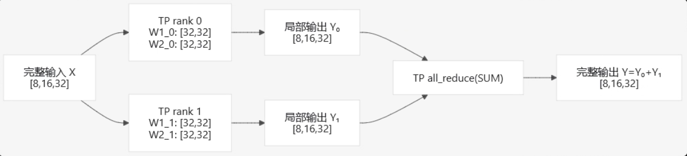
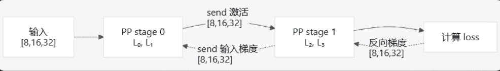
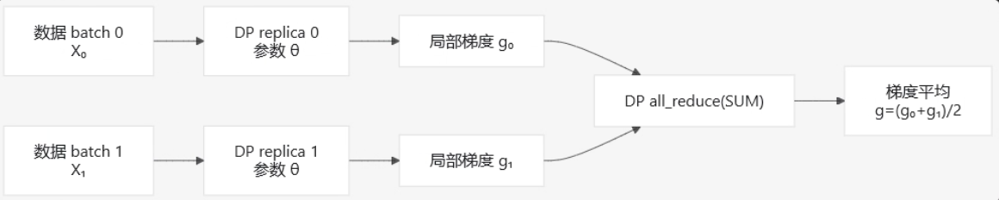
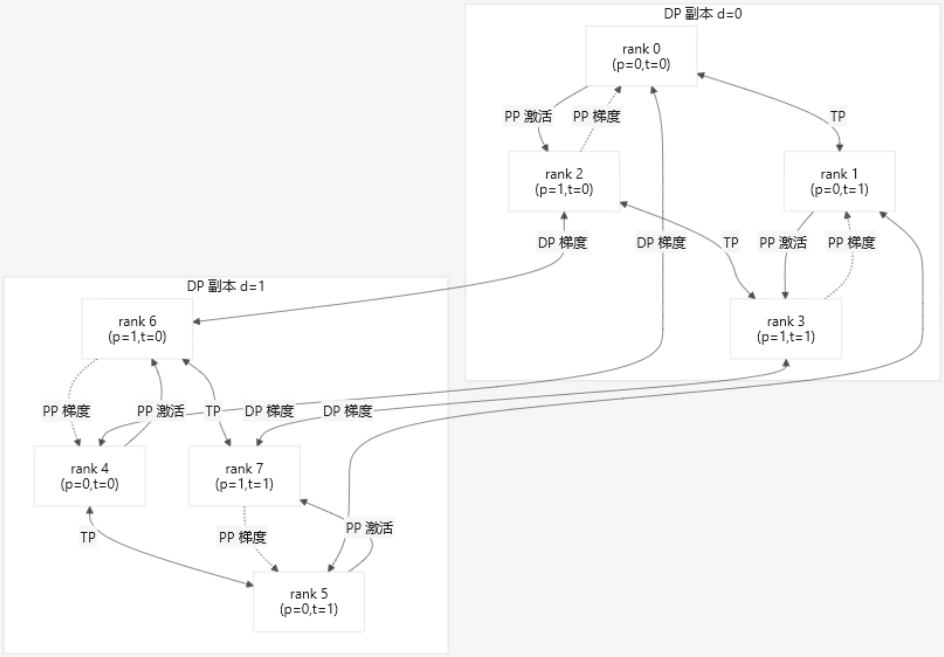
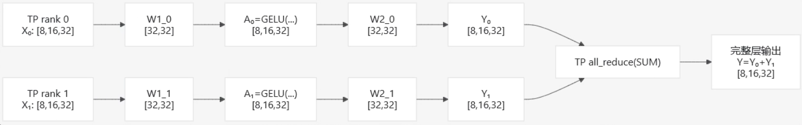
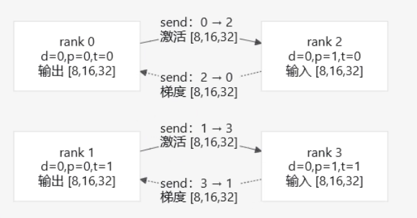
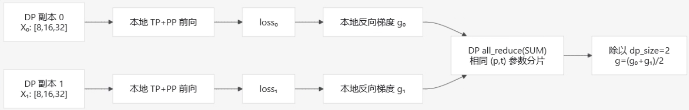
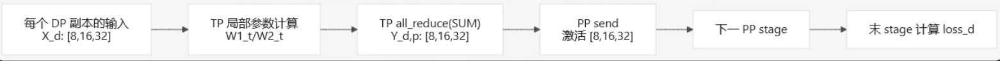

# TP、PP、DP 并行通信笔记

示例配置为：

$$
TP=2,\qquad PP=2,\qquad DP=2
$$

因此总进程数为：

$$
WORLD\_SIZE=TP\times PP\times DP=2\times2\times2=8
$$

测试模型的主要维度为：

$$
B=8,\qquad S=16,\qquad H=32,\qquad I=64,\qquad L=4
$$

其中：

- $B$：batch size；
- $S$：序列长度；
- $H$：hidden size；
- $I$：MLP intermediate size；
- $L$：网络层数。

该程序使用 Gloo 进行单机多进程通信模拟。CUDA 可用时，计算张量位于 CUDA 设备上，但 Gloo 通信数据会暂存到 CPU。

---

# 1. 单独 TP

## 1.1 基本流程

张量并行将同一层的参数切分到多个 TP rank。每个 rank 使用相同输入，但只计算自己负责的参数分片。



## 1.2 参数切分

输入张量在 TP rank 之间保持完整：

$$
X\in\mathbb{R}^{B\times S\times H}
=\mathbb{R}^{8\times16\times32}
$$

第一层权重为：

$$
W_1\in\mathbb{R}^{I\times H}
=\mathbb{R}^{64\times32}
$$

代码沿输出维切分：

$$
W_{1,t}\in\mathbb{R}^{I/TP\times H}
=\mathbb{R}^{32\times32}
$$

第二层权重为：

$$
W_2\in\mathbb{R}^{H\times I}
=\mathbb{R}^{32\times64}
$$

代码沿输入维切分：

$$
W_{2,t}\in\mathbb{R}^{H\times I/TP}
=\mathbb{R}^{32\times32}
$$

每个 rank 的局部计算为：

$$
A_t=
\operatorname{GELU}
\left(
XW_{1,t}^{T}+b_{1,t}
\right)
\in\mathbb{R}^{8\times16\times32}
$$

$$
Y_t=A_tW_{2,t}^{T}
\in\mathbb{R}^{8\times16\times32}
$$

TP 组内进行求和：

$$
Y=\sum_{t=0}^{TP-1}Y_t
$$

输出形状不变：

$$
[8,16,32]
\overset{\text{TP all-reduce}}{\longrightarrow}
[8,16,32]
$$

## 1.3 对应代码

`test_tensor_parallel()` 中的参数切分：

```python
local_intermediate = SHAPE.intermediate_size // group_size

column_weight = nn.Parameter(
    weight_1[
        group_rank * local_intermediate:
        (group_rank + 1) * local_intermediate
    ].clone()
)

row_weight = nn.Parameter(
    weight_2[
        :,
        group_rank * local_intermediate:
        (group_rank + 1) * local_intermediate
    ].clone()
)
```

TP 前向计算：

```python
local_activation = functional.gelu(
    functional.linear(tensor, column_weight, column_bias)
)

local_output = functional.linear(
    local_activation,
    row_weight,
)

output = _ReduceFromTensorParallel.apply(
    local_output,
    group,
    communication,
) + bias_2
```

`_ReduceFromTensorParallel` 的前向实现：

```python
result = tensor.clone()

communication.all_reduce(
    result,
    group=group,
    op=dist.ReduceOp.SUM,
)
```

需要注意，独立的 `test_tensor_parallel()` 中没有调用 `_CopyToTensorParallel`。该测试主要验证：

- TP 参数切分是否正确；
- TP 前向结果是否等于稠密参考模型；
- 每个 rank 的局部参数梯度是否正确。

`_ReduceFromTensorParallel.backward()` 不再执行通信，而是把完整输出梯度直接交给每个 TP 参数分片：

```python
return gradient, None, None
```

---

# 2. 单独 PP

## 2.1 模型划分

流水线并行按照网络层划分模型。4 层模型、2 个 PP stage 的划分为：

$$
\text{stage}_0=\{L_0,L_1\}
$$

$$
\text{stage}_1=\{L_2,L_3\}
$$

每个 stage 保存：

$$
L/PP=4/2=2
$$




## 2.2 激活和梯度维度

PP 不切分激活张量。输入、stage 输出以及 stage 间传递的数据均为：

$$
A\in\mathbb{R}^{B\times S\times H}
=\mathbb{R}^{8\times16\times32}
$$

前向传递：

$$
A_{\text{stage }0}
\in\mathbb{R}^{8\times16\times32}
\rightarrow
A_{\text{stage }1}
\in\mathbb{R}^{8\times16\times32}
$$

反向传递：

$$
\frac{\partial L}{\partial A_{\text{stage }1}}
\in\mathbb{R}^{8\times16\times32}
\rightarrow
\frac{\partial L}{\partial A_{\text{stage }0}}
\in\mathbb{R}^{8\times16\times32}
$$

## 2.3 对应代码

本地 stage 的参数选择：

```python
layers_per_stage = SHAPE.layer_count // group_size

local_parameters = [
    nn.Parameter(tensor.clone())
    for layer in layers[
        group_rank * layers_per_stage:
        (group_rank + 1) * layers_per_stage
    ]
    for tensor in layer
]
```

第一个 stage 直接使用本地输入：

```python
if group_rank == 0:
    activations = inputs
```

后续 stage 从前一个 stage 接收激活：

```python
activations = communication.receive(
    inputs.shape,
    inputs.dtype,
    global_ranks[group_rank - 1],
    group,
)

activations.requires_grad_(True)
pipeline_input = activations
```

前向发送：

```python
communication.send(
    stage_outputs.detach(),
    global_ranks[group_rank + 1],
    group,
)
```

反向接收梯度：

```python
output_gradient = communication.receive(
    stage_outputs.shape,
    stage_outputs.dtype,
    global_ranks[group_rank + 1],
    group,
)

stage_outputs.backward(output_gradient)
```

只有最后一个 stage 计算 loss：

```python
loss = functional.mse_loss(stage_outputs, targets)
loss.backward()
```

PP 的核心通信是点对点 `send/receive`，不是 `all_reduce`。

代码中还有用于测试校验的全局集合通信：

```python
communication.all_reduce(
    loss_tensor,
    op=dist.ReduceOp.MAX,
)
```

以及：

```python
communication.all_reduce(
    result,
    op=dist.ReduceOp.MIN,
)
```

这些操作用于同步测试结果，不属于 PP stage 间的核心数据传递。

---

# 3. 单独 DP

## 3.1 基本流程

数据并行创建多个模型副本。每个副本保存相同参数，但处理不同数据。



DP 副本使用不同输入：

$$
X_0\ne X_1
$$

每个副本的局部 batch 为：

$$
B_{\mathrm{local}}=8
$$

有效全局 batch 为：

$$
B_{\mathrm{effective}}
=DP\times B_{\mathrm{local}}
=2\times8=16
$$

## 3.2 梯度同步

每个 DP 副本独立计算局部梯度：

$$
g_0,\qquad g_1
$$

DP 组内进行求和：

$$
g_{\mathrm{sum}}=g_0+g_1
$$

再除以 DP 组大小：

$$
g=
\frac{1}{DP}
\sum_{d=0}^{DP-1}g_d
=
\frac{g_0+g_1}{2}
$$

参数梯度的形状不变。例如：

$$
g_{W_{1,t}}\in\mathbb{R}^{32\times32}
$$

同步后仍为：

$$
\frac{g_{W_{1,t},0}+g_{W_{1,t},1}}{2}
\in\mathbb{R}^{32\times32}
$$

## 3.3 对应代码

使用不同随机种子生成不同数据：

```python
local_inputs = make_tensor(
    (
        SHAPE.batch_size,
        SHAPE.sequence_length,
        SHAPE.hidden_size,
    ),
    3000 + group_rank,
    device,
)

local_targets = make_tensor(
    local_inputs.shape,
    4000 + group_rank,
    device,
    std=0.5,
)
```

每个副本独立反向：

```python
local_loss = functional.mse_loss(
    forward(local_inputs, parallel_parameters),
    local_targets,
)

local_loss.backward()
```

DP 梯度同步：

```python
for parameter in parallel_parameters:
    communication.all_reduce(
        parameter.grad,
        group=group,
    )
    parameter.grad.div_(group_size)
```

DP 前向没有跨 DP rank 的通信。DP 不传递激活，只同步相同模型参数副本产生的梯度。

`maximum_loss` 的 `all_reduce(MAX)` 只用于测试验证：

```python
communication.all_reduce(
    maximum_loss,
    op=dist.ReduceOp.MAX,
)
```

---

# 4. TP、PP、DP 联合并行

## 4.1 Rank 坐标

总进程数为：

$$
WORLD\_SIZE=TP\times PP\times DP=8
$$

全局 rank 映射为：

$$
\mathrm{rank}
=d(PP\times TP)+p\times TP+t
$$

反解为：

$$
t=\mathrm{rank}\bmod TP
$$

$$
p=
\left\lfloor
\frac{\mathrm{rank}}{TP}
\right\rfloor\bmod PP
$$

$$
d=
\left\lfloor
\frac{\mathrm{rank}}{TP\times PP}
\right\rfloor
$$

| rank | 坐标 $(d,p,t)$ |
|---:|:---:|
| 0 | $(0,0,0)$ |
| 1 | $(0,0,1)$ |
| 2 | $(0,1,0)$ |
| 3 | $(0,1,1)$ |
| 4 | $(1,0,0)$ |
| 5 | $(1,0,1)$ |
| 6 | $(1,1,0)$ |
| 7 | $(1,1,1)$ |

三类通信组的划分规则：

$$
\begin{aligned}
TP &: \text{固定 }(d,p)，改变 t\\
PP &: \text{固定 }(d,t)，改变 p\\
DP &: \text{固定 }(p,t)，改变 d
\end{aligned}
$$

对应 rank 分组：

```text
TP: (0,1), (2,3), (4,5), (6,7)
PP: (0,2), (1,3), (4,6), (5,7)
DP: (0,4), (1,5), (2,6), (3,7)
```



---

## 4.2 单个 PP stage 内的 TP 计算

对于任意 DP 副本 $d$ 和 PP stage $p$，两个 TP rank 共同计算该 stage 的每一层。

输入张量为：

$$
X_d\in\mathbb{R}^{B\times S\times H}
=\mathbb{R}^{8\times16\times32}
$$

每个 TP rank 都使用完整输入，但使用不同参数分片：

$$
W_{1,t}\in\mathbb{R}^{32\times32}
$$

$$
W_{2,t}\in\mathbb{R}^{32\times32}
$$





局部计算为：

$$
A_{d,p,t}
=
\operatorname{GELU}
\left(
X_{d,p}W_{1,p,t}^{T}+b_{1,p,t}
\right)
$$

$$
Y_{d,p,t}
=
A_{d,p,t}W_{2,p,t}^{T}
$$

TP 归约后：

$$
Y_{d,p}
=
\sum_{t=0}^{TP-1}Y_{d,p,t}
$$

形状变化为：

$$
[8,16,32]
\rightarrow
[8,16,32]
\overset{\text{TP all-reduce}}{\longrightarrow}
[8,16,32]
$$

对应代码：

```python
tensor = _CopyToTensorParallel.apply(
    tensor,
    groups.tensor_parallel_group,
    communication,
)

local_intermediate_output = functional.gelu(
    functional.linear(tensor, weight_1, bias_1)
)

local_output = functional.linear(
    local_intermediate_output,
    weight_2,
)

tensor = _ReduceFromTensorParallel.apply(
    local_output,
    groups.tensor_parallel_group,
    communication,
) + bias_2
```

其中：

- `_CopyToTensorParallel.forward()` 不执行通信；
- `_ReduceFromTensorParallel.forward()` 执行 TP `all_reduce(SUM)`；
- `_CopyToTensorParallel.backward()` 执行 TP 输入梯度归约；
- `_ReduceFromTensorParallel.backward()` 不再次归约。

---

## 4.3 PP stage 间的激活和梯度

以 DP 副本 $d=0$ 为例：




PP 前向：

$$
A_{d,p,t}
\in\mathbb{R}^{8\times16\times32}
\rightarrow
A_{d,p+1,t}
\in\mathbb{R}^{8\times16\times32}
$$

PP 反向：

$$
\frac{\partial L_d}{\partial A_{d,p+1,t}}
\in\mathbb{R}^{8\times16\times32}
\rightarrow
\frac{\partial L_d}{\partial A_{d,p,t}}
\in\mathbb{R}^{8\times16\times32}
$$

对应代码：

```python
communication.send(
    stage_outputs.detach(),
    groups.pipeline_parallel_global_ranks[pipeline_rank + 1],
    groups.pipeline_parallel_group,
)
```

```python
output_gradient = communication.receive(
    stage_outputs.shape,
    stage_outputs.dtype,
    groups.pipeline_parallel_global_ranks[pipeline_rank + 1],
    groups.pipeline_parallel_group,
)
```

PP 只连接相同 $(d,t)$ 的相邻 stage：

```text
(d=0,t=0): rank 0 → rank 2
(d=0,t=1): rank 1 → rank 3
(d=1,t=0): rank 4 → rank 6
(d=1,t=1): rank 5 → rank 7
```

---

## 4.4 DP 副本的独立计算和梯度同步

两个 DP 副本分别使用不同输入：

$$
X_0\ne X_1
$$

每个 DP 副本独立执行完整的 TP+PP 前向和反向：




对于固定的 PP stage $p$ 和 TP rank $t$，参数梯度为：

$$
g_{d,p,t}
=
\frac{\partial L_d}
{\partial\theta_{p,t}}
$$

DP 同步后：

$$
g_{p,t}
=
\frac{1}{DP}
\sum_{d=0}^{DP-1}g_{d,p,t}
$$

在本例中：

$$
g_{p,t}
=
\frac{g_{0,p,t}+g_{1,p,t}}{2}
$$

对应代码：

```python
for parameter in local_parameters:
    communication.all_reduce(
        parameter.grad,
        group=groups.data_parallel_group,
    )
    parameter.grad.div_(dp_size)
```

DP 组中的通信关系为：

```text
rank 0 ↔ rank 4
rank 1 ↔ rank 5
rank 2 ↔ rank 6
rank 3 ↔ rank 7
```

DP 不同步激活，也不参与 PP 的点对点传输。

---

## 4.5 联合前向和反向的完整顺序

### 前向




数学形式：

$$
X_d
\rightarrow
Y_{d,p,t}
\overset{\text{TP all-reduce}}{\longrightarrow}
Y_{d,p}
\overset{\text{PP send}}{\longrightarrow}
X_{d,p+1}
$$

其中：

$$
X_d,Y_{d,p,t},Y_{d,p},X_{d,p+1}
\in\mathbb{R}^{8\times16\times32}
$$

### 反向


联合反向可以写为：

$$
\frac{\partial L_d}{\partial Y_d}
\rightarrow
\left(
\frac{\partial L_d}{\partial X_d}
\right)_t
\overset{\text{TP all-reduce}}{\longrightarrow}
\frac{\partial L_d}{\partial X_d}
\overset{\text{PP send}}{\longrightarrow}
\text{前一 stage}
$$

完成每个 DP 副本的反向后，再执行：

$$
g_{0,p,t},g_{1,p,t}
\overset{\text{DP all-reduce}}{\longrightarrow}
\frac{g_{0,p,t}+g_{1,p,t}}{2}
$$

联合流程总结为：

1. 每个 DP 副本独立处理自己的 batch；
2. 每个 PP stage 内使用 TP 参数分片；
3. TP 组内通过 `all_reduce(SUM)` 合并局部输出；
4. PP 组内通过 `send/receive` 传递激活；
5. 最后一个 PP stage 计算 loss；
6. PP 通过反向 `send/receive` 传递梯度；
7. TP 组内通过 `all_reduce(SUM)` 汇总输入梯度；
8. DP 组内通过 `all_reduce(SUM)` 同步相同参数分片的梯度；
9. 除以 `dp_size` 得到平均梯度。

---

