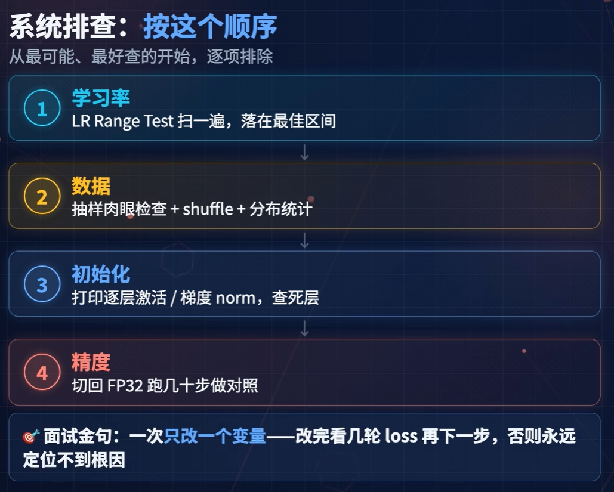
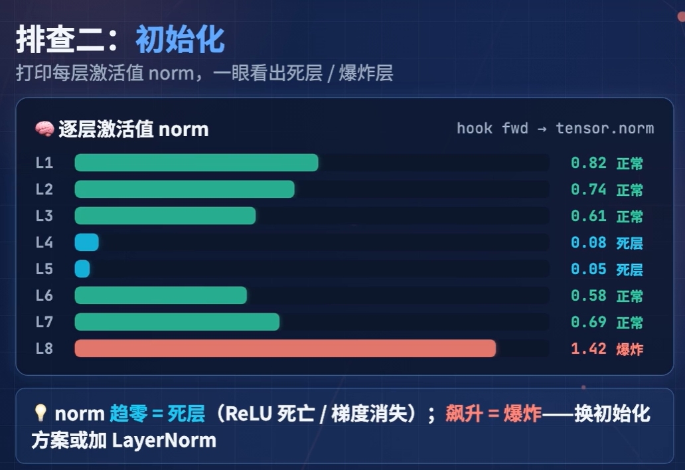
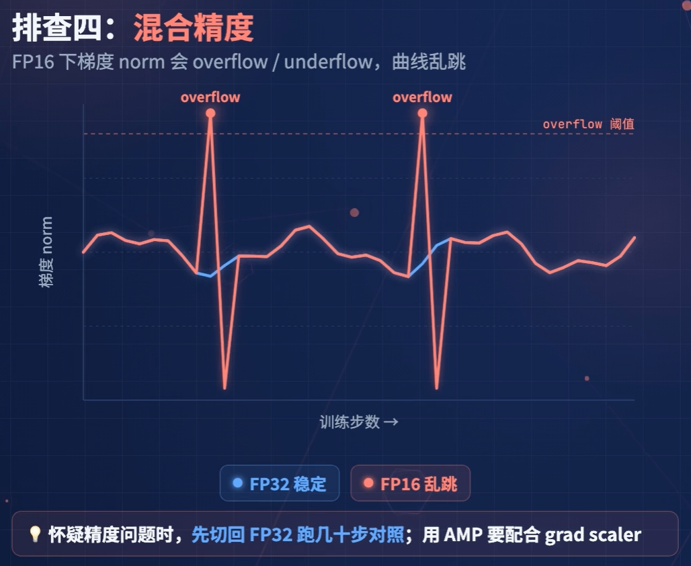

# 训练不收敛：视频严格版操作笔记

> 来源视频：[训练排障：训练不收敛的系统排查清单：学习率、数据、初始化、精度四步走](https://www.bilibili.com/video/BV1LQ8467E4e/)
>


## 1. 视频中的三种不收敛表现

1. **Loss 完全不降**：一直在初始值附近晃动。
2. **Loss 持续震荡**：降一点、升一点，没有明确趋势。
3. **Loss 先降后升**：常见方向是过拟合或学习率太大。

正常训练允许 Loss 小幅波动，但一段时间内应有整体下降趋势。


## 2. 视频规定的排查顺序




## 3. 第一步：学习率

### 视频中的方法

- 学习率太大：Loss 震荡或飙升。
- 学习率太小：Loss 几乎不动。
- 先比较：当前学习率、当前值的十分之一、当前值的十倍。
- 更科学的方法：**LR Range Test**，从极小学习率逐步增大，画出 Loss 曲线，寻找 Loss 下降最陡的区间。

### 代码：三个学习率对照

```python
from copy import deepcopy
import torch


def run_short(model, loader, criterion, lr, device="cuda", steps=100):
    """使用指定学习率进行短程训练，观察 Loss 是否下降。

    Args:
        model: 待测试的 PyTorch 模型。
        loader: 提供 inputs 和 labels 的训练数据加载器。
        criterion: 损失函数。
        lr: 本次实验使用的学习率。
        device: 训练设备，例如 cuda 或 cpu。
        steps: 最多执行的训练步数。

    Returns:
        包含学习率、状态和 Loss 记录的字典。
    """
    # 深拷贝模型，确保不同学习率实验互不影响。
    model = deepcopy(model).to(device)
    # 每次实验使用独立优化器，避免复用动量等历史状态。
    optimizer = torch.optim.AdamW(model.parameters(), lr=lr)
    losses = []
    iterator = iter(loader)
    model.train()  # 开启训练模式。

    for _ in range(steps):
        # 数据迭代器耗尽后重新开始，保证短实验能连续取到 batch。
        try:
            batch = next(iterator)
        except StopIteration:
            iterator = iter(loader)
            batch = next(iterator)

        # 将当前 batch 移动到模型所在设备。
        inputs = batch["inputs"].to(device)
        labels = batch["labels"].to(device)
        # 清空上一轮梯度，避免梯度错误累积。
        optimizer.zero_grad(set_to_none=True)

        # 前向计算和损失。
        outputs = model(inputs)
        loss = criterion(outputs, labels)

        # Loss 出现 NaN 或 Inf 时立即停止，避免继续污染参数。
        if not torch.isfinite(loss):
            return {"lr": lr, "status": "NaN/Inf", "losses": losses}

        # 反向传播并更新参数。
        loss.backward()
        optimizer.step()
        losses.append(loss.item())

    return {
        "lr": lr,
        "status": "finite",
        "first_loss": losses[0],
        "last_loss": losses[-1],
        "losses": losses,
    }


# 这里的数值只是示例；实际应替换为当前项目的学习率。
base_lr = 1e-4

# 按视频要求比较当前值、十分之一和十倍。
for lr in [base_lr / 10, base_lr, base_lr * 10]:
    print(run_short(model, train_loader, criterion, lr))
```

### 结果应该怎么看

| 结果 | 视频中的判断 |
|---|---|
| Loss 震荡或飙升 | 学习率可能太大 |
| Loss 几乎不动 | 学习率可能太小 |
| 某个学习率区间下降明显 | 优先在该区间继续调节 |
| 三组都不下降 | 转向检查数据、初始化和精度 |
| 三组都出现 NaN/Inf | 优先检查数值稳定性和初始化 |


### 代码：LR Range Test

```python
import math


def lr_range_test(model, loader, criterion,
                  start_lr=1e-7, end_lr=1e-1,
                  steps=200, device="cuda"):
    """逐步增大学习率，记录 Loss 曲线以定位有效区间。

    Args:
        model: 待测试的 PyTorch 模型。
        loader: 训练数据加载器。
        criterion: 损失函数。
        start_lr: 起始学习率。
        end_lr: 终止学习率。
        steps: 最大测试步数。
        device: 训练设备。

    Returns:
        每一步的 step、lr 和 loss 记录。
    """
    # 使用指数增长，让学习率覆盖较宽范围。
    optimizer = torch.optim.AdamW(model.parameters(), lr=start_lr)
    growth = (end_lr / start_lr) ** (1 / max(steps - 1, 1))
    records = []
    iterator = iter(loader)
    model.train()

    for step in range(steps):
        # 数据迭代器耗尽后重新开始，保证短实验能连续取到 batch。
        try:
            batch = next(iterator)
        except StopIteration:
            iterator = iter(loader)
            batch = next(iterator)

        # 在每一步更新优化器中的学习率。
        lr = start_lr * growth ** step
        for group in optimizer.param_groups:
            group["lr"] = lr

        # 将当前 batch 移动到模型所在设备。
        inputs = batch["inputs"].to(device)
        labels = batch["labels"].to(device)
        # 清空上一轮梯度，避免梯度错误累积。
        optimizer.zero_grad(set_to_none=True)
        loss = criterion(model(inputs), labels)
        records.append({"step": step, "lr": lr, "loss": loss.item()})

        # Loss 非有限时停止，避免继续扩大数值异常。
        if not math.isfinite(loss.item()):
            break
        loss.backward()
        optimizer.step()

    return records
```


## 4. 第三步：初始化

### 视频中的原理

权重初始化方差不对，会让前向信号逐层放大或缩小，从而造成**梯度消失**或**梯度爆炸**。




### 4.1 查看参数统计

```python
# 遍历可训练参数，检查初始化后的数值规模。
for name, param in model.named_parameters():
    if not param.requires_grad:
        continue

    # 转成 float 统计，避免低精度类型影响观察结果。
    value = param.detach().float()
    print(
        name,
        "mean=", value.mean().item(),
        "std=", value.std().item(),
        "min=", value.min().item(),
        "max=", value.max().item(),
    )
```

### 4.2 查看每层激活值范数

```python
# 保存各层前向输出的范数，用于观察信号是否逐层放大或缩小。
activation_norms = {}


def make_hook(name):
    """创建记录指定模块激活值范数的 forward hook。"""
    def hook(module, inputs, output):
        del module, inputs  # hook 中不需要这两个参数。
        value = output[0] if isinstance(output, tuple) else output
        activation_norms[name] = value.detach().float().norm().item()
    return hook


# 在线性层和 LayerNorm 上注册 hook，覆盖视频重点关注的层。
for name, module in model.named_modules():
    if isinstance(module, (torch.nn.Linear, torch.nn.LayerNorm)):
        module.register_forward_hook(make_hook(name))

# 运行一次前向传播，触发所有 hook。
_ = model(batch["inputs"].to("cuda"))

for name, value in activation_norms.items():
    print(name, "activation_norm=", value)
```

## 5. 第三步：数据


### 视频要求检查的三件事

#### 5.1 DataLoader 是否 shuffle

如果不 shuffle，每个 epoch 的数据顺序固定，模型可能学到顺序而不是内容。

```python
from torch.utils.data import DataLoader

# 训练集启用 shuffle，避免每个 epoch 使用完全相同的数据顺序。
train_loader = DataLoader(
    train_dataset,
    batch_size=32,
    shuffle=True,
)
```

正确检查重点：训练集 DataLoader 的 `shuffle` 应为 `True`。

#### 5.2 输入和标签是否合理

```python
# 取出一个 batch，直接检查送入模型的真实数据。
batch = next(iter(train_loader))

print("inputs shape:", batch["inputs"].shape)
print("labels shape:", batch["labels"].shape)
print("inputs sample:", batch["inputs"][0])
print("labels sample:", batch["labels"][0])  # 检查标签是否与输入对应。
```

视频建议打印几个 batch，检查：

- 输入是否是预期内容。
- 标签是否与输入对应。
- 输入和标签的形状是否合理。
- 标签是否明显错误。

#### 5.3 标签分布是否偏斜

```python
from collections import Counter

# 统计标签出现次数，用于发现类别分布明显偏斜。
label_counts = Counter()
for batch in train_loader:
    label_counts.update(batch["labels"].view(-1).tolist())

print(label_counts)
```

如果某些类别样本太少，数据分布可能导致模型难以学习这些类别。视频没有给出一个固定的“正确比例”，判断标准是是否存在明显偏斜，或是否与预期数据分布不一致。


## 6. 第四步：精度和数值稳定性



### 视频中的风险

- 混合精度中的 FP16 可能导致某些层精度不够。

### 6.1 FP32 对照实验

```python
# 使用 FP16 混合精度计算，作为待检查的训练路径。
with torch.autocast(device_type="cuda", dtype=torch.float16):
    loss_fp16 = criterion(model(inputs), labels)

# 关闭 autocast，使用 FP32 作为对照实验。
with torch.autocast(device_type="cuda", enabled=False):
    loss_fp32 = criterion(model(inputs.float()), labels)

print("FP16 loss:", loss_fp16.item())
print("FP32 loss:", loss_fp32.item())
print("FP16 finite:", torch.isfinite(loss_fp16).item())
print("FP32 finite:", torch.isfinite(loss_fp32).item())
```


